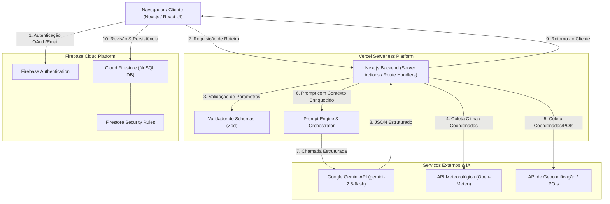
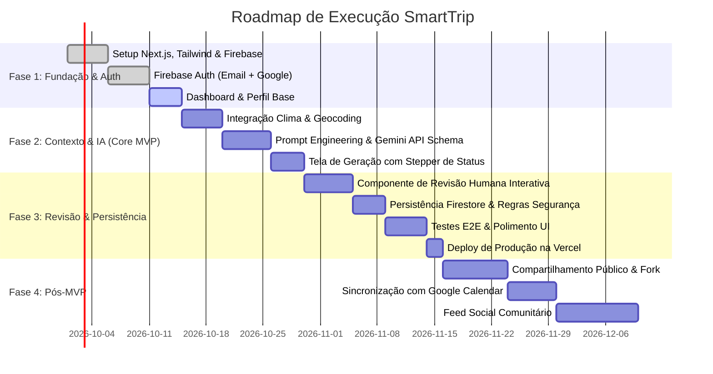

# SPEC Mestre do SmartTrip

**Documento:** Especificação Técnica e de Produto (Product & Technical Specification)  
**Versão:** 1.0.0  
**Data:** 2026-09-19  
**Status:** Aprovado para Implementação  
**Autor:** Antigravity AI & Engenharia SmartTrip  

---

## 1. Visão do Produto

O **SmartTrip** é um assistente inteligente de viagens projetado como solução integradora para viajantes modernos que buscam otimizar seu tempo de planejamento e transformar janelas de folga em roteiros práticos, realistas e personalizados.

Ao combinar **Inteligência Artificial Generativa (Google Gemini)** com dados contextuais em tempo real — como **previsão meteorológica**, **geolocalização** e **pontos de interesse (POIs)** —, o SmartTrip elimina a sobrecarga cognitiva da montagem de itinerários manuais. 

Diferente de geradores genéricos de texto, o SmartTrip opera sob a filosofia **"IA propõe, o humano dispõe"**: a IA atua como co-piloto estruturado, entregando uma base hipercontextualizada em formato modular, garantindo que o usuário tenha total soberania para editar, reorganizar e validar cada parada da sua viagem antes de consolidá-la.

---

## 2. Personas

### Persona 1: Larissa, a Profissional Ocupada
* **Idade:** 31 anos  
* **Ocupação:** Gerente de Projetos de Tecnologia  
* **Perfil:** Possui rotina acelerada e acumula pequenos feriados e pontes de fim de semana. Gosta de viajar, mas não tem paciência nem horas livres para pesquisar dezenas de blogs, checar previsão do tempo em uma aba e conferir mapas em outra.  
* **Dores:** Falta de tempo; estresse ao tentar encaixar atrações geograficamente distantes no mesmo turno; roteiros irrealistas gerados por IAs que ignoram horários de funcionamento ou clima chuvoso.  
* **Objetivo no SmartTrip:** Inserir suas datas de folga e estilo de viagem (gastronomia e caminhadas leves) e obter em menos de 1 minuto um itinerário coerente com a previsão climática e que ela possa ajustar rapidamente.

### Persona 2: Thiago, o Mochileiro Estruturado
* **Idade:** 24 anos  
* **Ocupação:** Designer Gráfico / Freelancer  
* **Perfil:** Viaja com orçamento enxuto ou moderado, focando em experiências autênticas, culturais e ao ar livre. Valoriza controle fino e organização.  
* **Dores:** Dificuldade em manter organizadas listas de lugares salvos; aplicativos de viagem pesados que forçam pacotes comerciais; perder passeios ao ar livre por desconsiderar chuva.  
* **Objetivo no SmartTrip:** Explorar destinos a partir de preferências temáticas, ver alternativas sob medida para dias ensolarados ou nublados, e manter uma biblioteca pessoal de roteiros salvos para revisitar e adaptar.

---

## 3. Objetivos

### 3.1 Objetivos de Negócio
- Demonstrar a aplicação prática de IA Generativa de ponta (Google Gemini) integrada a sistemas modernos em nuvem (Next.js, Firebase, Vercel) para um projeto acadêmico/profissional de alto impacto.
- Estabelecer uma arquitetura resiliente, de baixo custo operacional e escalável para validação de produto no mercado (Product-Led Growth).

### 3.2 Objetivos de Produto
- Reduzir o tempo médio de criação de um roteiro de viagem completo de **3 horas para menos de 45 segundos**.
- Garantir 100% de coerência contextual nos roteiros (ex.: sugestões de museus e locais fechados em períodos de chuva prevista; atrações ordenadas por proximidade geográfica).
- Entregar um fluxo fluido de **revisão humana**, onde 100% dos blocos gerados pela IA possam ser editados, reordenados ou excluídos.

### 3.3 Métricas de Sucesso (OKRs / KPIs)
- **Taxa de Conclusão de Roteiro:** > 75% dos roteiros gerados são revisados e salvos pelo usuário.
- **Latência de Geração da IA:** Resposta estruturada retornada em < 12 segundos com feedback de progresso na UI.
- **Índice de Retenção:** Usuários salvam e consultam em média 2+ viagens em suas contas.

---

## 4. Escopo MVP (Obrigatório)

O MVP contemplará os módulos essenciais e indivisíveis:

1. **Autenticação:** Cadastro por e-mail/senha e Google OAuth via Firebase Authentication; login persistente; recuperação de senha; logout seguro.
2. **Perfil do Usuário:** Dados cadastrais básicos, bio, cidade base e gestão de sessão.
3. **Períodos de Folga:** Registro e seleção de janelas temporais (data inicial e data final) para viagens e escapadas.
4. **Preferências de Viagem:** Seleção de estilo (cultural, gastronômico, aventura, relaxante, família), ritmo (tranquilo, moderado, intenso) e faixa de orçamento (econômico, moderado, luxo).
5. **Busca de Destino & Geolocalização:** Mecanismo de busca de cidades/regiões com preenchimento assistido e resolução de coordenadas (latitude/longitude).
6. **Dados Climáticos em Tempo Real:** Consulta de previsão do tempo (temperatura mínima/máxima, probabilidade de chuva e condição climática) para o destino durante a janela de datas selecionada.
7. **Pontos de Interesse (POIs):** Obtenção de atrações relevantes, categorias e coordenadas para subsidiar a IA.
8. **Geração de Roteiro com Gemini:** Orquestração de prompt estruturado via API do Gemini alimentado com: destino, datas, clima, POIs, estilo e ritmo, gerando itinerário dia a dia em formato JSON estrito.
9. **Revisão Humana:** Interface interativa para o usuário editar títulos, horários, descrições, adicionar paradas manuais ou excluir sugestões da IA antes ou após salvar.
10. **Persistência no Cloud Firestore:** Armazenamento seguro de itinerários, perfil e preferências no banco NoSQL.
11. **Listagem e Exclusão de Viagens:** Dashboard do usuário exibindo viagens futuras e passadas, com opção de visualização detalhada e exclusão física/lógica.
12. **Segurança:** Isolamento de chaves no servidor (Next.js API/Server Actions), regras de segurança granulares no Firestore (`firestore.rules`) por `request.auth.uid`.
13. **Deploy Automatizado:** Pipeline de Continuous Deployment configurado na Vercel com variáveis de ambiente protegidas.

---

## 5. Escopo Pós-MVP (Evoluções Futuras)

Recursos priorizados para as fases subsequentes de tração:

1. **Compartilhamento Público de Roteiros:** Geração de link público (somente leitura) com metadados OpenGraph para pré-visualização em WhatsApp, Telegram e redes sociais.
2. **Feed Social & Descoberta:** Feed comunitário de roteiros públicos criados por outros viajantes com filtros por destino e tags.
3. **Fork/Cópia de Roteiro ("Clone Trip"):** Capacidade de duplicar o roteiro de outro usuário para o próprio perfil e customizá-lo.
4. **Viagens em Grupo & Colaboração:** Convite de co-editores por e-mail com permissões de leitura ou edição simultânea no Firestore.
5. **Votação de Atrações:** Sistema de enquete interna no grupo para aprovação de atividades em equipe.
6. **Sincronização com Google Calendar:** Exportação das atividades diárias diretamente para a agenda do Google via OAuth scopes adicionais.
7. **Painel de Administração:** Dashboard para monitoramento de métricas operacionais, contagem de tokens consumidos, custos de API e gestão de usuários suspensos.

---

## 6. Jornadas do Usuário

### 6.1 Jornada Principal (Criação e Revisão de Roteiro no MVP)
```
[Início] 
   │
   ▼
[Login / Cadastro] ──(Autenticado)──► [Dashboard Principal]
                                             │
                                             ▼
                                     [Novo Roteiro]
                                             │
   ┌─────────────────────────────────────────┴─────────────────────────────────────────┐
   ▼                                         ▼                                         ▼
[1. Definir Folga/Datas]          [2. Selecionar Destino]                  [3. Ajustar Preferências]
(Data Início e Fim)               (Autocompletar Geográfico)               (Ritmo, Estilo, Orçamento)
   └─────────────────────────────────────────┬─────────────────────────────────────────┘
                                             │
                                             ▼
                              [Busca Automática de Clima e POIs]
                                             │
                                             ▼
                              [Submissão ao Agente Gemini]
                              (Feedback visual com progresso)
                                             │
                                             ▼
                              [Visualização do Roteiro Proposto]
                                             │
                                             ▼
                              [Revisão Humana Interativa]
                              (Editar textos, excluir ou adicionar itens)
                                             │
                                             ▼
                              [Confirmar e Salvar no Firestore]
                                             │
                                             ▼
                              [Dashboard: Viagem Pronta para Uso]
```

### 6.2 Jornada de Gestão de Roteiros
```
[Dashboard] ──► [Lista de Viagens] 
                      │
        ┌─────────────┴─────────────┐
        ▼                           ▼
[Visualizar Detalhes]       [Excluir Roteiro]
        │                           │
        ▼                           ▼
[Edição Contínua]           [Confirmação Modal]
                                    │
                                    ▼
                            [Remoção no Firestore]
```

---

## 7. Histórias de Usuário (US)

* **US-001:** Como viajante, quero me cadastrar e autenticar via e-mail/senha ou Google OAuth, para que meus dados e roteiros fiquem protegidos e acessíveis em qualquer dispositivo.
* **US-002:** Como usuário, quero gerenciar meu perfil (nome, foto e preferências padrão), para que o assistente personalize as sugestões automaticamente.
* **US-003:** Como usuário, quero cadastrar minhas janelas de folga e feriados, para selecionar rapidamente o intervalo de datas da minha próxima viagem.
* **US-004:** Como viajante, quero pesquisar destinos com resolução de cidade/país, para que o sistema capture latitude e longitude precisas.
* **US-005:** Como viajante, quero visualizar o resumo do clima previsto para as datas selecionadas, para saber se enfrentarei chuva, frio ou calor no destino.
* **US-006:** Como viajante, quero que o sistema identifique os principais pontos de interesse do destino alinhados ao meu estilo, para alimentar o gerador inteligente.
* **US-007:** Como usuário, quero que o Gemini gere um itinerário detalhado dia a dia, distribuído em turnos (manhã, tarde e noite), adaptado ao clima e ao meu ritmo de viagem.
* **US-008:** Como usuário, quero revisar e alterar qualquer atividade sugerida pela IA (editar título, horário, descrição ou remover item), garantindo que o roteiro final seja do meu jeito.
* **US-009:** Como usuário, quero poder adicionar paradas e atrações manuais ao itinerário gerado, completando informações que a IA não incluiu.
* **US-010:** Como usuário, quero salvar o itinerário revisado na minha conta, para acessá-lo offline ou antes do embarque.
* **US-011:** Como usuário, quero ver uma lista organizada das minhas viagens (planejadas e concluídas) no meu dashboard.
* **US-012:** Como usuário, quero excluir roteiros antigos ou descartados, mantendo meu painel limpo.
* **US-013:** Como usuário pós-MVP, quero compartilhar meu roteiro através de um link público para amigos verem meu planejamento.
* **US-014:** Como usuário pós-MVP, quero clonar um roteiro compartilhado por outro membro da comunidade para adaptar à minha viagem.
* **US-015:** Como usuário pós-MVP, quero sincronizar as atividades do meu roteiro com o Google Calendar em um clique.

---

## 8. Requisitos Funcionais (RF)

### Módulo de Autenticação e Usuário
* **RF-001:** O sistema deve permitir cadastro e login de usuários com e-mail/senha utilizando Firebase Authentication.
* **RF-002:** O sistema deve permitir login social com conta Google via Firebase Auth.
* **RF-003:** O sistema deve fornecer fluxo de recuperação de senha por e-mail com link seguro.
* **RF-004:** O sistema deve manter a sessão do usuário de forma persistente e permitir logout explícito com limpeza de tokens locais.
* **RF-005:** O sistema deve criar automaticamente um documento de perfil na coleção `users` no Firestore no primeiro acesso do usuário.

### Módulo de Destino, Folga e Contexto
* **RF-006:** O sistema deve permitir a seleção de intervalo de datas (Data Inicial e Data Final), validando período mínimo de 1 dia e máximo de 15 dias no MVP.
* **RF-007:** O sistema deve fornecer busca preditiva de destinos com autocomplete e resolução de geocoordenadas (latitude e longitude).
* **RF-008:** O sistema deve integrar API meteorológica para recuperar previsão diária (temperatura mínima, máxima, código de tempo WMO e precipitação) para as coordenadas e datas solicitadas.
* **RF-009:** O sistema deve coletar parâmetros de preferência do usuário: estilos de viagem (múltipla escolha), ritmo (baixo/moderado/intenso) e faixa de orçamento (econômico/moderado/alto).

### Módulo de IA e Geração de Roteiro
* **RF-010:** O sistema deve compor um payload estruturado contendo dados contextuais (destino, datas, clima previsto, preferências) e submeter à API do Gemini via backend seguro.
* **RF-011:** O sistema deve forçar a resposta do Gemini em formato JSON estrito aderente ao schema de dados de itinerário (`TripItinerarySchema`), utilizando `responseSchema` da SDK do Gemini.
* **RF-012:** O itinerário gerado deve dividir cada dia em turnos lógicos (manhã, tarde, noite) contendo: horário sugerido, título do local, descrição contextual, custo estimado e dica prática alinhada ao clima.
* **RF-013:** O sistema deve exibir estado visual de carregamento com indicação de etapas (ex.: "Consultando clima...", "Analisando atrações...", "Montando seu roteiro...") durante a chamada da IA.

### Módulo de Revisão Humana e Persistência
* **RF-014:** O sistema deve renderizar o itinerário em cards interativos com opção de edição em linha (inline editing) de títulos, descrições e horários.
* **RF-015:** O sistema deve permitir que o usuário remova qualquer atividade sugerida com um clique.
* **RF-016:** O sistema deve permitir a inclusão de uma nova atividade personalizada em qualquer dia/turno do itinerário.
* **RF-017:** O sistema deve permitir salvar o roteiro completo no Cloud Firestore vinculado ao `userId` autenticado.
* **RF-018:** O sistema deve listar no dashboard todas as viagens salvas do usuário, ordenadas por data de criação decrescente.
* **RF-019:** O sistema deve permitir a exclusão definitiva de uma viagem salva mediante confirmação em modal.

---

## 9. Requisitos Não Funcionais (RNF)

* **RNF-001 (Desempenho):** O First Contentful Paint (FCP) inicial da aplicação deve ser inferior a 1,5 segundos em conexões 4G padrão.
* **RNF-002 (Tempo de Resposta IA):** A geração do roteiro pelo Gemini deve retornar para a interface em até 15 segundos.
* **RNF-003 (Disponibilidade):** A aplicação deve alcançar disponibilidade de 99,5% hospedada na infraestrutura Vercel + Firebase.
* **RNF-004 (Segurança de Chaves):** As credenciais de acesso às APIs (Gemini API Key, Firebase Private Keys) nunca devem ser expostas no cliente (browser).
* **RNF-005 (Design Responsivo):** A interface deve ser 100% responsiva, oferecendo experiência de ponta em telas mobile (a partir de 360px) e desktop (até 4K).
* **RNF-006 (Acessibilidade):** A interface deve atingir conformidade WCAG 2.1 nível AA, com contraste adequado, tags semânticas e suporte a leitores de tela.
* **RNF-007 (Validação de Schema):** Todos os dados recebidos de APIs externas e do Gemini devem ser validados via Zod antes do consumo pela UI ou persistência no banco.
* **RNF-008 (Compatibilidade):** Suporte garantido aos navegadores evergreen (Chrome, Firefox, Safari, Edge) em suas versões mais recentes.

---

## 10. Regras de Negócio (RN)

* **RN-001 (Limite de Dias no MVP):** O intervalo entre a Data Inicial e a Data Final não pode ser inferior a 1 dia nem exceder 15 dias consecutivos.
* **RN-002 (Data no Futuro):** A data de início da viagem deve ser igual ou posterior à data atual (horário UTC local do destino).
* **RN-003 (Limitação de Clima):** Para viagens com início superior a 14 dias da data atual (limite de previsões meteorológicas determinísticas), o sistema deve utilizar dados médios sazonais/históricos e exibir aviso informativo ao usuário.
* **RN-004 (Coerência Climática Obrigatória):** Em dias onde a probabilidade de precipitação for superior a 60%, a IA deve prioritariamente sugerir atividades em ambientes cobertos (museus, centros gastronômicos, galerias, teatros) durante os períodos de chuva.
* **RN-005 (Propriedade e Isolamento de Dados):** Um usuário só pode visualizar, editar ou excluir viagens cujo campo `userId` seja estritamente igual ao seu `auth.uid`.
* **RN-006 (Sanitização de Entradas):** Campos de texto livre preenchidos pelo usuário devem ser sanitizados contra scripts maliciosos (XSS) e contra injeção de comandos de prompt (Prompt Injection) antes do envio ao Gemini.
* **RN-007 (Estado da Viagem):** Toda viagem recém-gerada inicia com o status `draft`. Ao ser confirmada na revisão humana, passa para o status `saved`.
* **RN-008 (Limite de Roteiros Salvos no MVP):** Cada usuário gratuito pode manter até 20 roteiros salvos simultaneamente para evitar estouro de cotas no Firestore.

---

## 11. Arquitetura do Sistema

### 11.1 Visão Geral
A solução adota arquitetura moderna baseada em **Next.js (App Router)** executando em ambiente Serverless na **Vercel**, com desacoplamento entre camada de apresentação, serviços de backend/orquestração de IA e armazenamento em nuvem no **Firebase (Google Cloud)**.



### 11.2 Componentes da Arquitetura
1. **Frontend (Client Tier):**
   - Construído com Next.js (React 19), Tailwind CSS / Vanilla CSS moderno com estética refinada (modo escuro/claro, microinterações fluidas).
   - Gerenciamento de estado de tela com React Hooks nativos e estados otimistas para a revisão humana.
2. **Backend / API Tier (Next.js Server Actions / API Routes):**
   - Atua como Gateway de orquestração seguro.
   - Centraliza e protege a `GEMINI_API_KEY`.
   - Executa a validação de contratos de dados de entrada e saída com Zod.
3. **Persistência e Autenticação (Firebase Tier):**
   - **Firebase Authentication:** Emite JWTs validados pelo cliente e pelo backend.
   - **Cloud Firestore:** Armazena documentos de usuários e roteiros, com controle de acesso enforcementado por regras no servidor (`firestore.rules`).

---

## 12. Modelo de Dados Conceitual

O modelo NoSQL no Firestore é projetado em coleções raiz com granularidade focada em isolamento de dados e consultas performáticas:

```mermaid
erDiagram
    USERS ||--o{ TRIPS : "possui"
    TRIPS ||--|{ DAYS : "contém"
    DAYS ||--|{ ACTIVITIES : "organiza em turnos"

    USERS {
        string uid PK "ID do Firebase Auth"
        string email "E-mail do usuário"
        string displayName "Nome de exibição"
        string photoURL "URL do avatar"
        object defaultPreferences "Preferências padrão"
        timestamp createdAt "Data de criação"
        timestamp updatedAt "Data de atualização"
    }

    TRIPS {
        string tripId PK "Identificador único da viagem"
        string userId FK "Vínculo ao usuário (uid)"
        string destination "Nome da cidade/destino"
        object coordinates "{ lat: number, lng: number }"
        string startDate "YYYY-MM-DD"
        string endDate "YYYY-MM-DD"
        number durationDays "Duração em dias"
        object preferencesSnapshot "Cópia das preferências usadas"
        object weatherSummary "Resumo da previsão utilizada"
        string status "'draft' | 'saved' | 'archived'"
        timestamp createdAt "Data de criação"
        timestamp updatedAt "Data da última alteração"
    }

    DAYS {
        number dayNumber "Dia 1, Dia 2..."
        string date "YYYY-MM-DD"
        object dayWeather "{ tempMin, tempMax, condition, rainProb }"
    }

    ACTIVITIES {
        string activityId "ID único da atividade"
        string timeSlot "'morning' | 'afternoon' | 'evening'"
        string suggestedTime "Ex: 09:30"
        string title "Nome da atração/atividade"
        string description "Descrição contextual"
        string category "'cultural' | 'food' | 'nature' | 'leisure'"
        string estimatedCost "'grátis' | '$' | '$$' | '$$$'"
        string weatherTip "Dica ligada ao clima do dia"
        boolean isUserCreated "True se adicionada manualmente"
    }
```

### 12.1 Estrutura de Documento Firestore (`trips/{tripId}`)
```json
{
  "id": "trip_abc123xyz",
  "userId": "usr_998877",
  "title": "Escapada Cultural em Montevidéu",
  "destination": "Montevidéu, Uruguai",
  "coordinates": {
    "lat": -34.9011,
    "lng": -56.1645
  },
  "startDate": "2026-10-10",
  "endDate": "2026-10-13",
  "durationDays": 4,
  "status": "saved",
  "preferences": {
    "styles": ["gastronomia", "cultural"],
    "pace": "moderado",
    "budget": "moderado"
  },
  "weatherSummary": {
    "avgTemp": 19.5,
    "hasRainRisk": true
  },
  "itinerary": [
    {
      "dayIndex": 1,
      "date": "2026-10-10",
      "weather": {
        "tempMin": 14,
        "tempMax": 22,
        "rainProbability": 20,
        "condition": "Parcialmente Nublado"
      },
      "activities": [
        {
          "id": "act_001",
          "period": "morning",
          "time": "09:30",
          "title": "Caminhada pela Ciudad Vieja e Teatro Solís",
          "description": "Passeio a pé pelo centro histórico com visita guiada ao teatro.",
          "category": "cultural",
          "estimatedCost": "$$",
          "weatherTip": "Manhã amena e sem chuva, ideal para caminhada ao ar livre.",
          "isCustom": false
        }
      ]
    }
  ],
  "createdAt": "2026-09-19T13:20:00Z",
  "updatedAt": "2026-09-19T13:25:00Z"
}
```

---

## 13. Integrações Externas

### 13.1 Google Gemini API
- **Modelo Utilizado:** `gemini-2.5-flash` (alta velocidade de inferência, janela de contexto ampla e suporte nativo a Structured Outputs via JSON Schema).
- **Modo de Operação:** Chamada backend via SDK oficial `@google/genai` utilizando `responseMimeType: "application/json"` e `responseSchema` estrito.
- **System Instruction:** Persona de guia de viagens hiperlocal, proibindo alucinações de locais inexistentes e exigindo adaptação das atividades ao clima previsto.

### 13.2 Provedor Meteorológico (Open-Meteo API)
- **Endpoint:** `https://api.open-meteo.com/v1/forecast`
- **Características:** Sem necessidade de chave sensível no plano aberto, alta confiabilidade e suporte a previsões diárias com temperatura máxima, mínima, probabilidade de chuva e códigos meteorológicos WMO.

### 13.3 Provedor de Geocodificação & POIs
- **Geocoding:** Integração com Nominatim (OpenStreetMap) ou Google Places API para autocomplete de cidades e resolução das coordenadas `(lat, lng)`.

### 13.4 Firebase Authentication & Cloud Firestore
- **Auth:** Client SDK para controle de estado da sessão no frontend e validação de tokens nos endpoints serverless.
- **Firestore:** Armazenamento em nuvem multirregional com sincronização em tempo real e offline caching nativo.

---

## 14. Segurança e Privacidade

1. **Gestão de Segredos:**
   - Variáveis sensíveis (`GEMINI_API_KEY`, credenciais de serviço) configuradas exclusivamente no painel da Vercel (`Environment Variables`) e no `.env.local` de desenvolvimento, nunca versionadas no Git.
2. **Regras de Segurança do Firestore (`firestore.rules`):**
   ```javascript
   rules_version = '2';
   service cloud.firestore {
     match /databases/{database}/documents {
       match /users/{userId} {
         allow read, write: if request.auth != null && request.auth.uid == userId;
       }
       match /trips/{tripId} {
         allow create: if request.auth != null && request.resource.data.userId == request.auth.uid;
         allow read, update, delete: if request.auth != null && resource.data.userId == request.auth.uid;
       }
     }
   }
   ```
3. **Prevenção de Abuso e Rate Limiting:**
   - Limitação de taxa em endpoints de geração de roteiro (ex.: máximo de 5 gerações por hora por IP/usuário) para blindar contra estouro de cotas da API do Gemini.
4. **Proteção contra Injeção de Prompt:**
   - Parâmetros recebidos do usuário passam por validação estrita de tipos via Zod. Textos livres são encapsulados em tags delimitadas no prompt para neutralizar instruções maliciosas.

---

## 15. Critérios de Aceite Globais (CA)

* **CA-001 (Acesso Restrito):** Rotas protegidas (`/dashboard`, `/nova-viagem`, `/roteiro/:id`) devem redirecionar automaticamente para `/login` quando acessadas por usuários não autenticados.
* **CA-002 (Validação de Período):** O seletor de datas não deve permitir que a data de término seja anterior à data de início, nem períodos superiores a 15 dias no MVP.
* **CA-003 (Schema Válido da IA):** Toda geração do Gemini deve ser validada contra o schema Zod. Se houver falha de parse, o sistema deve executar 1 retry automático antes de exibir mensagem de erro tratada ao usuário.
* **CA-004 (Persistência da Revisão):** Qualquer alteração feita pelo usuário na tela de revisão (edição de texto, exclusão de atividade, adição de parada) deve ser refletida fielmente no banco de dados ao clicar em "Salvar Roteiro".
* **CA-005 (Responsividade da UI):** Todos os componentes da interface devem ser utilizáveis sem quebras visuais em resoluções de 360px a 1920px.
* **CA-006 (Exclusão Segura):** A exclusão de um roteiro deve exigir confirmação explícita em modal de aviso e remover imediatamente o card do dashboard do usuário.
* **CA-007 (Tratamento de Indisponibilidade):** Caso a API de clima esteja indisponível, a IA deve ser instruída a gerar o roteiro com aviso de clima não sincronizado, sem travar o fluxo do usuário.

---

## 16. Estratégia de Testes

### 16.1 Testes Unitários
- **Ferramenta:** Vitest / Jest.
- **Escopo:** Funções utilitárias (cálculo de dias, formatação de datas, geradores de prompts, validadores de schemas Zod).

### 16.2 Testes de Integração
- **Escopo:**
  - Validação do fluxo de orquestração de APIs (Next.js Server Action -> Weather API -> Mock do Gemini).
  - Teste das regras de segurança do Firestore utilizando o Firebase Local Emulator Suite (`@firebase/rules-unit-testing`).

### 16.3 Testes Ponta a Ponta (E2E)
- **Ferramenta:** Playwright.
- **Cenários Cobertos:**
  - Fluxo completo: Login -> Preenchimento de formulário de viagem -> Visualização do itinerário gerado -> Edição de 1 atividade -> Salvar -> Verificação no Dashboard.
  - Fluxo de exclusão de viagem.

### 16.4 Avaliação de IA (Prompt Evaluation)
- Dataset sintético de 20 casos de teste com combinações extremas (ex.: "Tóquio com chuva forte por 3 dias", "Paris ritmo intenso econômico") avaliando:
  - Respeito à estrutura JSON (taxa esperada de 100%).
  - Alinhamento climático (ausência de atividades externas em tempestades).

---

## 17. Riscos e Mitigações

| Risco | Probabilidade | Impacto | Estratégia de Mitigação |
| :--- | :---: | :---: | :--- |
| **Alucinação da IA** (locais fechados ou inexistentes) | Média | Alto | Injetar lista preliminar de POIs validados no prompt e instruir o Gemini a priorizar apenas atrações renomadas e verificáveis. |
| **Estouro de Cota da API Gemini** | Média | Alto | Implementar rate limit por usuário, debounce na UI e cache de respostas para buscas idênticas. |
| **Indisponibilidade da API Meteorológica** | Baixa | Médio | Fallback gracioso: prosseguir a geração alertando o usuário que o clima não pôde ser verificado em tempo real. |
| **Tempo de Resposta Elevado da IA** | Alta | Médio | Feedback progressivo na UI (stepper animado com frases de status) para reduzir percepção de espera. |
| **Tentativa de Injeção de Prompt** | Baixa | Alto | Sanitização severa das strings de preferências via Zod e isolamento estrito no prompt do sistema. |

---

## 18. Fora de Escopo

Os seguintes itens **NÃO** fazem parte do MVP nem das evoluções imediatas:
- Reserva ou compra direta de passagens aéreas, hotéis ou ingressos de atrações.
- Gateway de pagamento e planos de assinatura pagos.
- Aplicativo nativo compilado para iOS e Android (foco 100% em Web App responsivo).
- Modo offline completo com sincronização bidirecional em background.
- Suporte a múltiplos idiomas além do Português do Brasil no MVP.

---

## 19. Roadmap Incremental



- **Fase 1 (Fundação e Autenticação):** Setup do ecossistema Next.js, autenticação Firebase, layout global e perfil.
- **Fase 2 (Contexto e Inteligência):** Serviços de clima, geocodificação, orquestrador Gemini e validação JSON Schema.
- **Fase 3 (Revisão, Persistência e Lançamento MVP):** Interface de revisão humana, salvamento no Firestore, testes e deploy Vercel.
- **Fase 4 (Recursos Sociais e Integrações Pós-MVP):** Compartilhamento público, clonagem de roteiro e integração com Google Calendar.

---

## 20. Definition of Done (DoD)

Para que qualquer história de usuário ou funcionalidade seja considerada concluída, os seguintes critérios devem ser estritamente atendidos:

1. **Rastreabilidade Completa:** O código e commits devem referenciar o ID da funcionalidade (ex.: `feat: US-007 / RF-011`).
2. **Tipagem Estrita:** Código 100% tipado com TypeScript, sem uso de `any` explícito ou implícito.
3. **Qualidade de Código:** Validação sem erros em `npm run lint` e compilação sem falhas em `npm run build`.
4. **Validação de Schemas:** Todo dado externo ou resposta de IA deve ser validado por schema Zod antes de atingir o estado da aplicação.
5. **Critérios de Aceite Atendidos:** Todos os critérios de aceite (CA) vinculados à funcionalidade devem ser demonstrados com sucesso.
6. **Segurança Verificada:** Regras de segurança do Firestore ativas e testadas; nenhuma chave de API exposta no bundle do cliente.
7. **Deploy Funcional:** Funcionalidade em execução no ambiente de preview ou produção na Vercel.
