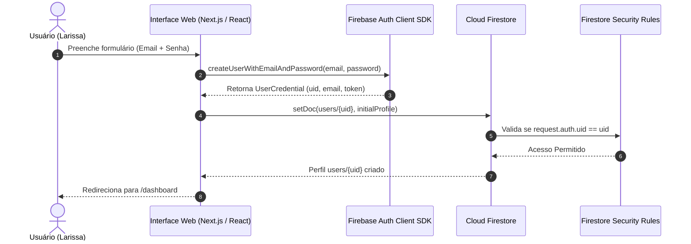
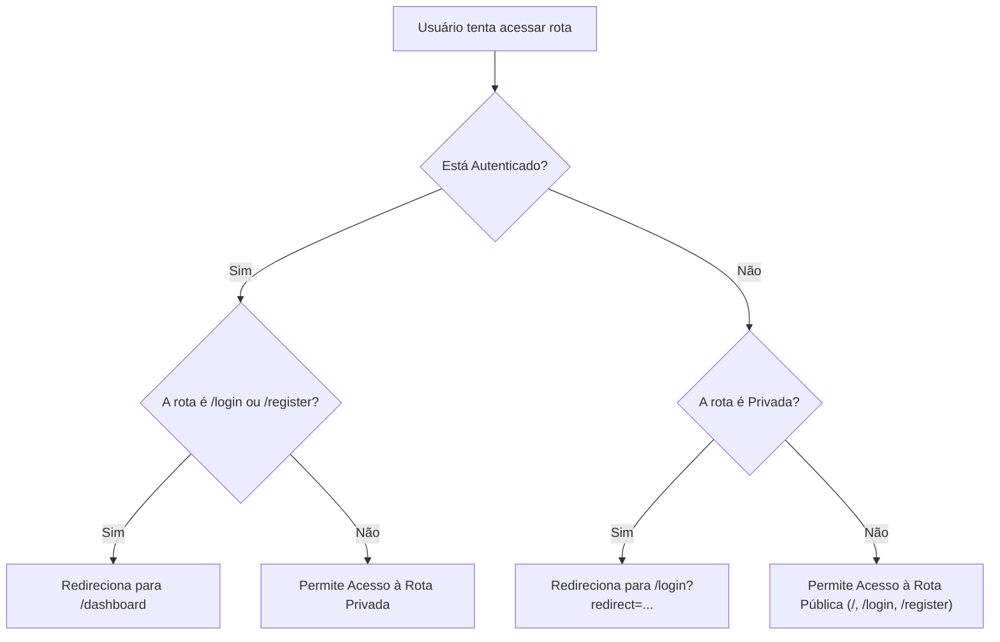

# SPEC Técnica: Autenticação e Gestão de Identidade (SmartTrip)

**Documento:** Especificação Técnica de Autenticação e Autorização (Identity & Access Management Specification)  
**ID do Documento:** SPEC-AUTH-001  
**Versão:** 1.0.0  
**Data:** 2026-09-19  
**Status:** Aprovado para Implementação  
**Rastreabilidade:** Alinhado à [SPEC Mestre](../SPEC_MESTRE.md), [SPEC Operacional](SPEC_OPERACIONAL.md) e [SPEC Firebase](SPEC_FIREBASE.md)  

---

## 1. Visão Geral e Princípio de Confiança Zero (*Zero-Trust Client*)

A camada de autenticação do **SmartTrip** estabelece a ponte de confiança entre a identidade do viajante e seus dados persistidos no Cloud Firestore. 

Adota-se rigorosamente o princípio de **Confiança Zero no Cliente**:
- **Nenhum parâmetro de identificação (`userId`) enviado no corpo de requisições ou no payload do cliente é considerado fidedigno.**
- A única fonte de autoridade e identidade válida em todo o ciclo de vida da aplicação é o token criptográfico JWT emitido e assinado pelo Google Identity Platform, validado no lado do servidor/Firestore através de `request.auth.uid`.

---

## 2. Métodos e Fluxos de Autenticação



### 2.1 Cadastro por E-mail e Senha
1. **Validação Prévia na Interface:**
   - E-mail sintaticamente válido (`name@domain.tld`).
   - Senha com no mínimo 6 caracteres (recomendado: 8+ caracteres com letras e números).
   - Confirmação de senha estritamente coincidente.
   - Aceite obrigatório dos Termos de Uso.
2. **Execução no SDK:**
   - Chamada a `createUserWithEmailAndPassword(auth, email, password)`.
   - Captura do `uid` recém-gerado.
3. **Provisionamento Automático de Perfil:**
   - Imediatamente após a criação no Auth, o sistema grava o documento base em `users/{uid}` com `role: "user"`.

### 2.2 Login por E-mail e Senha
1. Chamada a `signInWithEmailAndPassword(auth, email, password)`.
2. Emissão do token de sessão e gatilho do listener `onAuthStateChanged`.
3. Redirecionamento automático para a rota de destino (padrão: `/dashboard`, ou URL salva no parâmetro `?redirect=...`).

### 2.3 Login Social via Google OAuth
1. Instanciação de `GoogleAuthProvider`.
2. Execução via `signInWithPopup(auth, provider)` (desktop) ou fallback para `signInWithRedirect`.
3. Se for o primeiro acesso da conta Google, provisiona automaticamente o documento em `users/{uid}` utilizando `displayName` e `photoURL` fornecidos pelo perfil Google.

### 2.4 Logout Seguro
1. Chamada explícita a `signOut(auth)`.
2. O Firebase Client SDK invalida os tokens na memória do navegador e em `localStorage`/`indexedDB`.
3. Limpeza do estado de usuário no `AuthContext`.
4. Redirecionamento imediato para a Landing Page pública (`/`).

### 2.5 Recuperação de Senha
1. O usuário informa o e-mail cadastrado na tela `/login`.
2. O sistema invoca `sendPasswordResetEmail(auth, email)`.
3. **Mitigação de Ataques de Enumeração de E-mails:** A interface sempre exibe mensagem neutra de sucesso: *"Se houver uma conta cadastrada com este e-mail, as instruções de redefinição foram enviadas."*, mesmo que o e-mail não exista no banco.

---

## 3. Ciclo de Vida do Perfil de Usuário (`users/{uid}`) e RBAC

### 3.1 Papel Padrão (*Default Role*)
Todo novo usuário cadastrado recebe compulsoriamente o papel:
```typescript
role: 'user'
```

### 3.2 Prevenção de Autoelevação de Privilégios (*Privilege Escalation Defense*)
Um dos riscos mais críticos em aplicações serverless/Firestore é o usuário modificar seu próprio perfil para `role: "admin"` via console do navegador ou requisição forjada.

**Defesas Mandatórias Implementadas:**
1. **Regra de Imutabilidade no Firestore:** A regra de segurança do Firestore proíbe que o campo `role` seja alterado pelo próprio usuário após a criação.
2. **Elevação Somente via Backend / Custom Claims:** Qualquer atribuição futura de papel administrativo só pode ser realizada via **Firebase Admin SDK** no servidor através de `admin.auth().setCustomUserClaims(uid, { role: 'admin' })`.

### 3.3 Estrutura do Documento `users/{uid}`
```typescript
export interface UserProfileDocument {
  uid: string;                 // Chave primária (idêntica ao auth.uid)
  email: string;               // E-mail verificado/declarado
  displayName: string;         // Nome completo do viajante
  photoURL: string | null;     // URL do avatar
  homeCity: string;            // Cidade base (ex: "São Paulo, SP")
  role: 'user' | 'admin';      // Papel RBAC (padrão: 'user')
  preferences: {
    styles: string[];          // Ex: ["Gastronomia", "Cultura"]
    pace: 'tranquilo' | 'moderado' | 'intenso';
    budget: 'economico' | 'moderado' | 'luxo';
  };
  createdAt: any;              // FieldValue.serverTimestamp()
  updatedAt: any;              // FieldValue.serverTimestamp()
}
```

---

## 4. Gestão de Sessão e Estado Reativo

### 4.1 Persistência de Sessão
- Configurada explicitamente como `browserLocalPersistence`.
- A sessão sobrevive a atualizações de página (`F5`), novas abas do mesmo navegador e reinicializações da máquina do usuário.

### 4.2 Listener Centralizado (`onAuthStateChanged`)
A aplicação mantém um único listener global registrado na inicialização através de um `AuthProvider`:

```typescript
useEffect(() => {
  const unsubscribe = onAuthStateChanged(auth, async (firebaseUser) => {
    if (firebaseUser) {
      // 1. Usuário autenticado: busca documento complementar no Firestore
      const userDoc = await fetchUserProfile(firebaseUser.uid);
      setCurrentUser(userDoc);
    } else {
      // 2. Deslogado
      setCurrentUser(null);
    }
    setIsAuthLoading(false);
  });
  return () => unsubscribe();
}, []);
```

### 4.3 Estados do Ciclo de Autenticação
- `INITIALIZING` (`isAuthLoading === true`): Estado transitório enquanto o Firebase valida o token no IndexedDB. A UI renderiza um skeleton ou tela de splash discreta, evitando redirecionamentos falsos para `/login`.
- `AUTHENTICATED`: Usuário validado e perfil carregado.
- `UNAUTHENTICATED`: Nenhuma credencial ativa no navegador.

---

## 5. Proteção de Rotas e Redirecionamentos



### 5.1 Matriz de Rotas
| Rota | Classificação | Comportamento se NÃO Autenticado | Comportamento se Autenticado |
| :--- | :---: | :--- | :--- |
| `/` | Pública | Acesso Permitido | Acesso Permitido |
| `/login` | Pública / Auth | Acesso Permitido | **Redireciona para `/dashboard`** |
| `/register` | Pública / Auth | Acesso Permitido | **Redireciona para `/dashboard`** |
| `/dashboard` | Privada | **Redireciona para `/login?redirect=/dashboard`** | Acesso Permitido |
| `/profile` | Privada | **Redireciona para `/login?redirect=/profile`** | Acesso Permitido |
| `/availability` | Privada | **Redireciona para `/login?redirect=/availability`** | Acesso Permitido |
| `/explore` | Privada | **Redireciona para `/login?redirect=/explore`** | Acesso Permitido |
| `/trips` | Privada | **Redireciona para `/login?redirect=/trips`** | Acesso Permitido |
| `/trips/:id` | Privada | **Redireciona para `/login?redirect=/trips/:id`** | Acesso Permitido |

---

## 6. Dicionário de Códigos e Mensagens de Erro (I18n em Português)

O sistema deve interceptar códigos do Firebase Auth e apresentar mensagens amigáveis:

| Código de Erro Firebase | Mensagem Apresentada ao Usuário |
| :--- | :--- |
| `auth/invalid-email` | "O endereço de e-mail informado é inválido." |
| `auth/user-not-found` | "E-mail ou senha incorretos. Verifique suas credenciais." |
| `auth/wrong-password` | "E-mail ou senha incorretos. Verifique suas credenciais." |
| `auth/invalid-credential` | "Credenciais inválidas ou expiradas. Tente novamente." |
| `auth/email-already-in-use` | "Este e-mail já está cadastrado. Faça login ou recupere sua senha." |
| `auth/weak-password` | "A senha deve conter no mínimo 6 caracteres." |
| `auth/too-many-requests` | "Muitas tentativas sem sucesso. Aguarde alguns minutos antes de tentar novamente." |
| `auth/popup-closed-by-user` | "O processo de login com Google foi cancelado antes da conclusão." |
| `auth/network-request-failed`| "Falha de conexão com a internet. Verifique sua rede e tente novamente." |

---

## 7. Regras de Segurança do Firestore (`firestore.rules`)

As regras declarativas abaixo garantem enforcement estrito da identidade e impedem autoelevação:

```javascript
rules_version = '2';
service cloud.firestore {
  match /databases/{database}/documents {

    function isAuthenticated() {
      return request.auth != null;
    }

    function isOwner(userId) {
      return isAuthenticated() && request.auth.uid == userId;
    }

    // Regras de Autenticação e Perfil
    match /users/{userId} {
      allow read: if isOwner(userId);
      
      // Criação inicial: role DEVE ser obrigatoriamente 'user'
      allow create: if isOwner(userId) 
                    && request.resource.data.role == 'user'
                    && request.resource.data.keys().hasAll(['email', 'displayName', 'role', 'createdAt']);

      // Atualização: PROIBIDO alterar o campo 'role' diretamente pelo cliente
      allow update: if isOwner(userId)
                    && (!request.resource.data.diff(resource.data).affectedKeys().hasAny(['role', 'email', 'uid', 'createdAt']))
                    && request.resource.data.updatedAt == request.time;

      allow delete: if false; // Contas só podem ser excluídas via rotas administrativas controladas
    }

    // Regras de Viagens (Isolamento por uid do token)
    match /trips/{tripId} {
      allow read, delete: if isAuthenticated() && resource.data.userId == request.auth.uid;
      
      // Criação: userId gravado DEVE ser igual ao uid do token JWT
      allow create: if isAuthenticated() 
                    && request.resource.data.userId == request.auth.uid
                    && request.resource.data.durationDays >= 1
                    && request.resource.data.durationDays <= 15;

      // Edição: proibido transferir posse do roteiro para outro usuário
      allow update: if isAuthenticated() 
                    && resource.data.userId == request.auth.uid
                    && request.resource.data.userId == request.auth.uid;
    }
  }
}
```

---

## 8. Estratégia de Testes de Isolamento Multi-Usuário

Para homologar a segurança e o isolamento de identidade, a suíte de testes deve simular compulsoriamente **dois usuários concorrentes**:

### Cenário de Teste: Validação de Isolamento entre Larissa e Thiago
* **Usuário A:** `Larissa Mendes` (`uid_larissa_001`, role: `'user'`)
* **Usuário B:** `Thiago Rocha` (`uid_thiago_002`, role: `'user'`)

```mermaid
graph TD
    subgraph UserA_Context["Contexto de Larissa (uid_larissa_001)"]
        CreateTrip["1. Cria viagem 'Montevidéu' (userId: uid_larissa_001)"]
    end

    subgraph UserB_Context["Contexto de Thiago (uid_thiago_002)"]
        Attack1["2. Tenta ler viagem de Larissa (/trips/trip_larissa)"]
        Attack2["3. Tenta criar viagem forjando userId = uid_larissa_001"]
        Attack3["4. Tenta atualizar seu próprio perfil com { role: 'admin' }"]
    end

    CreateTrip -->|Sucesso| DB[(Cloud Firestore)]
    Attack1 -->|Violou Rule: resource.data.userId == auth.uid| Block1["❌ REJEITADO: Permission Denied"]
    Attack2 -->|Violou Rule: request.resource.data.userId == auth.uid| Block2["❌ REJEITADO: Permission Denied"]
    Attack3 -->|Violou Rule: affectedKeys().hasAny(['role'])| Block3["❌ REJEITADO: Permission Denied"]
```

### Casos de Teste Automatizados de Autorização:
1. **TC-AUTH-001 (Isolamento de Leitura):** O Usuário B autenticado tenta executar `getDoc(/trips/trip_larissa)`. O Firestore Emulator deve retornar erro `PERMISSION_DENIED`.
2. **TC-AUTH-002 (Prevenção de Spoofing no Create):** O Usuário B tenta salvar uma viagem contendo no documento `{ userId: "uid_larissa_001" }`. A operação é sumariamente rejeitada porque `request.auth.uid` (`uid_thiago_002`) difere do `userId` do payload.
3. **TC-AUTH-003 (Defesa contra Autoelevação):** O Usuário A tenta executar `updateDoc(/users/uid_larissa_001, { role: "admin" })`. O Firestore rejeita com `PERMISSION_DENIED`.
4. **TC-AUTH-004 (Persistência de Perfil Inicial):** Ao registrar nova conta, verificar que o documento `/users/{uid}` é gravado com `role: "user"` e `displayName`.

---

## 9. Critérios de Aceite Verificáveis (`CA-AUTH`)

* **CA-AUTH-001 (Cadastro com Perfil Automático):** O cadastro bem-sucedido via e-mail ou Google deve criar simultaneamente o usuário no Firebase Auth e o documento correspondente em `users/{uid}`.
* **CA-AUTH-002 (Validação de Senha Fraca):** A tentativa de cadastro com senha menor que 6 caracteres deve ser bloqueada antes do envio ao servidor com mensagem clara.
* **CA-AUTH-003 (Login Persistente):** Ao efetuar login e recarregar a aplicação em `/dashboard`, a sessão deve ser restabelecida sem flicker de redirecionamento.
* **CA-AUTH-004 (Redirecionamento Pós-Login):** Tentar acessar `/explore` deslogado redireciona para `/login?redirect=/explore`. Após o login bem-sucedido, o usuário é devolvido para `/explore`.
* **CA-AUTH-005 (Proteção de Rotas Públicas):** Usuário já autenticado ao acessar `/login` ou `/register` deve ser redirecionado para `/dashboard`.
* **CA-AUTH-006 (Zero Confiança em Parâmetros):** O frontend não deve permitir nem fornecer opções para que um usuário defina ou envie o `userId` de terceiros em mutações de viagem.
* **CA-AUTH-007 (Bloqueio de Autoelevação):** Nenhuma chamada direta do cliente pode alterar o campo `role` para `admin`.
* **CA-AUTH-008 (Feedback de Recuperação de Senha):** O formulário de recuperação deve tratar o retorno com mensagem clara sem confirmar a existência ou não do e-mail.
* **CA-AUTH-009 (Isolamento Concorrente):** Em testes automatizados, dois tokens de usuários diferentes nunca podem acessar dados um do outro.
