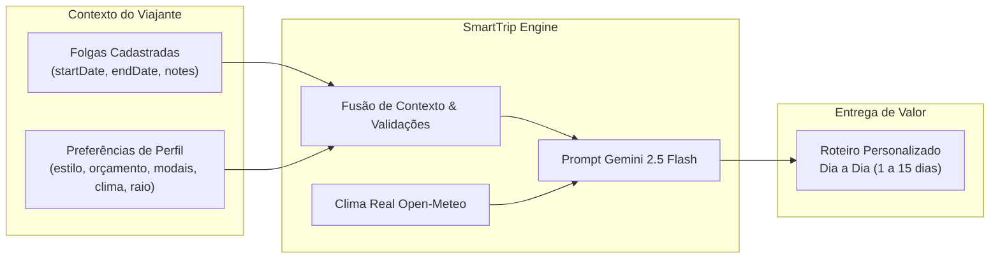

# SPEC Conjunta: Períodos de Folga e Preferências de Viagem (SmartTrip)

**Documento:** Especificação Funcional e Técnica (Availability & Traveler Preferences Specification)  
**ID do Documento:** SPEC-AVAIL-PREF-001  
**Versão:** 1.1.0  
**Data:** 2026-09-19  
**Status:** Aprovado para Implementação  
**Rastreabilidade:** Alinhado à [SPEC Mestre](../SPEC_MESTRE.md), [SPEC Interface](SPEC_INTERFACE.md), [SPEC Firebase](SPEC_FIREBASE.md) e [SPEC Modelagem Firestore](SPEC_FIRESTORE_DATA_MODEL.md)  

---

## 1. Visão Geral e Sinergia dos Módulos

O SmartTrip baseia seu motor de recomendações inteligentes na combinação sinérgica de dois pilares fundamentais de contexto do viajante:
1. **Janela Temporal (Disponibilidade / Folgas):** Define *quando* o usuário pode viajar, a duração em dias inclusivos e notas contextuais.
2. **Perfil Psicométrico (Preferências de Viagem):** Define *como* o usuário viaja (interesses, orçamento, ritmo, modais de transporte, clima preferido e raio máximo de deslocamento).

A fusão contínua desses dados alimenta diretamente o pipeline de inteligência artificial (**Google Gemini 2.5 Flash**), pré-calibrando o gerador de roteiros sem exigir preenchimento repetitivo a cada nova viagem.



---

## 2. Módulo A: Períodos de Folga (Disponibilidade)

### 2.1 Modelo de Dados da Entidade (`availability`)

* **Caminho no Firestore:** `/users/{userId}/availabilities/{availabilityId}`
* **Proprietário:** Usuário autenticado com `request.auth.uid == userId`.
* **Estratégia de Armazenamento:** Subcoleção do documento do usuário, garantindo escalabilidade ilimitada, isolamento estrito de dados e prevenção de estouro do limite de 1MB do documento pai.

#### Tabela de Atributos
| Campo | Tipo | Obrigatório? | Regra / Descrição |
| :--- | :--- | :---: | :--- |
| `id` | `string` | Sim | Identificador único (`av_` + timestamp ou auto-id alfanumérico). |
| `userId` | `string` | Sim | UID do proprietário, correspondente ao `users/{userId}`. |
| `title` | `string` | Sim | Título da folga (ex: "Feriado Tiradentes", "Férias Coletivas"). Mín. 2, máx. 60 caracteres. |
| `startDate` | `string` | Sim | Data de início em formato ISO `YYYY-MM-DD`. |
| `endDate` | `string` | Sim | Data de término em formato ISO `YYYY-MM-DD` (`endDate >= startDate`). |
| `durationDays` | `number` | Sim | Inteiro inclusivo calculado: $(\text{endDate} - \text{startDate}) + 1$. |
| `notes` | `string` | Não | Observações contextuais (ex: "Viagem leve", "Comemoração de aniversário"). Máx. 300 caracteres. |
| `createdAt` | `timestamp` | Sim | Timestamp de criação via `serverTimestamp()`. |
| `updatedAt` | `timestamp` | Sim | Timestamp da última modificação via `serverTimestamp()`. |

#### Contratos TypeScript
```typescript
export interface Availability {
  id: string;
  userId: string;
  title: string;
  startDate: string; // ISO YYYY-MM-DD
  endDate: string;   // ISO YYYY-MM-DD
  durationDays: number;
  notes?: string;
  createdAt: any;
  updatedAt: any;
}

export type CreateAvailabilityDTO = Omit<Availability, 'id' | 'createdAt' | 'updatedAt'>;
export type UpdateAvailabilityDTO = Partial<Omit<Availability, 'id' | 'userId' | 'createdAt' | 'updatedAt'>>;
```

### 2.2 Operações CRUD
1. **Criação (`createAvailability`):**
   - Modal acessado via botão `+ Adicionar Folga`.
   - DatePicker com intervalo selecionável.
   - Cálculo reativo imediato do campo `durationDays`.
   - Persistência assíncrona com feedback visual (Toast de sucesso).
2. **Listagem (`listUserAvailabilities`):**
   - Query ordenada por `startDate ASC`.
   - Exibição de cards informativos contendo título, datas formatadas (DD/MM/AAAA), badge com contagem de dias, notas e botão de atalho *"Planejar Viagem Nesta Folga"*.
3. **Edição (`updateAvailability`):**
   - Permite alteração de `title`, `startDate`, `endDate` e `notes`.
   - Recálculo compulsório de `durationDays`.
   - Atualiza `updatedAt` com `serverTimestamp()`.
4. **Exclusão (`deleteAvailability`):**
   - Exclusão física definitiva com modal de confirmação ("Deseja realmente remover esta folga?").
   - Remoção imediata da UI em padrão otimista com reversão em caso de erro.

### 2.3 Validação de Intervalos
* **Consistência Cronológica:** `startDate` deve ser cronologicamente anterior ou igual a `endDate`.
* **Formato Estrito:** Validação com regex `^\d{4}-\d{2}-\d{2}$` e verificação de data válida (evita dias inexistentes como `2026-02-30`).
* **Duração Mínima:** 1 dia (`startDate === endDate`).
* **Duração Máxima para Folgas:** 30 dias (se o usuário for gerar um itinerário MVP no Explore, incide a regra de 1 a 15 dias).
* **Datas no Passado:** Permitidas para arquivamento/histórico, mas ao clicar em *"Planejar Viagem"*, o sistema avisa que a data já expirou e sugere ajustar para um período futuro.

### 2.4 Detecção e Tratamento de Conflitos (Sobreposições)

A sobreposição entre uma folga proposta ($N$) e uma folga existente ($E$) ocorre quando:
$$\text{Overlap} \iff (N_{\text{start}} \le E_{\text{end}}) \land (N_{\text{end}} \ge E_{\text{start}})$$

#### Comportamento de UX para Conflitos
1. O conflito **não é bloqueante por padrão**, pois o usuário pode desejar registrar intenções paralelas ou desdobrar períodos.
2. Ao detectar sobreposição em tempo de digitação/seleção, a interface exibe um **Banner de Alerta Amarelo**:
   > ⚠️ **Sobreposição de Período Detectada**  
   > *Este intervalo coincide com a folga existente **"Férias de Outubro"** (10/10/2026 a 18/10/2026).*
3. O formulário disponibiliza duas opções claras:
   - **Salvar Mesmo Assim**: Conclui o cadastro mantendo ambos os registros.
   - **Ajustar Datas**: Foca o seletor para correção imediata.

---

## 3. Módulo B: Preferências de Viagem

### 3.1 Modelo de Dados da Entidade (`preferences`)

* **Localização no Firestore:** Embutido como Map no documento `/users/{userId}` sob o campo `preferences`.
* **Justificativa de Arquitetura:**
  - Leitura única $O(1)$ agregada aos dados da sessão do usuário.
  - Zero custo de queries adicionais no carregamento inicial da aplicação.
  - Atualização atômica direta via `updateDoc`.

#### Tabela de Atributos
| Atributo | Tipo | Obrigatório? | Valores Válidos / Restrições |
| :--- | :--- | :---: | :--- |
| `styles` | `array<string>` | Sim | Mínimo 1 estilo selecionado. Opções válidas: `'Gastronomia'`, `'Cultura'`, `'Caminhadas Urbanas'`, `'Natureza & Trilhas'`, `'Praia & Mar'`, `'Relaxamento & Spa'`, `'Vida Noturna'`, `'História'`, `'Compras'`. |
| `budget` | `string` | Sim | Nível orçamentário: `'economico'` ($), `'moderado'` ($$), `'luxo'` ($$$). |
| `pace` | `string` | Sim | Ritmo de exploração diária: `'tranquilo'` (1 a 2 atividades/dia), `'moderado'` (3 a 4 atividades/dia), `'intenso'` (5+ atividades/dia). |
| `transportation` | `array<string>` | Sim | Modais prioritários (mín. 1): `'caminhada'`, `'transporte_publico'`, `'carro_aplicativo'`, `'bicicleta'`. |
| `preferredWeather`| `string` | Sim | Clima preferido: `'calor_sol'`, `'ameno_primavera'`, `'frio_inverno'`, `'indiferente'`. |
| `maxDistanceKm` | `number` | Sim | Raio máximo de deslocamento diário da hospedagem: número inteiro entre **2 km** e **300 km** (Default: 15 km). |

#### Contratos TypeScript
```typescript
export type TravelBudget = 'economico' | 'moderado' | 'luxo';
export type TravelPace = 'tranquilo' | 'moderado' | 'intenso';
export type WeatherPreference = 'calor_sol' | 'ameno_primavera' | 'frio_inverno' | 'indiferente';
export type TransportMode = 'caminhada' | 'transporte_publico' | 'carro_aplicativo' | 'bicicleta';

export interface UserPreferences {
  styles: string[];
  budget: TravelBudget;
  pace: TravelPace;
  transportation: TransportMode[];
  preferredWeather: WeatherPreference;
  maxDistanceKm: number;
}
```

### 3.2 Validações de Preferências
1. **Seleção Não-Vazia:** `styles.length >= 1` e `transportation.length >= 1`. Se o usuário clicar para desmarcar a última pílula ativa, a UI bloqueia a desmarcação e emite um alerta tooltip: *"Mantenha ao menos uma opção selecionada."*
2. **Faixa Numérica Estrita:** `maxDistanceKm` deve ser inteiro no intervalo $[2, 300]$.
3. **Consistência Semântica:** Se o único transporte selecionado for `'caminhada'` e o raio for configurado acima de 20 km, exibe alerta educativo: *"Atenção: distâncias superiores a 20 km a pé podem demandar condicionamento físico intenso."*

---

## 4. Experiência do Usuário (UX), Wireframes e Estados

### 4.1 Gestão de Folgas (`/availability`)
* **Desktop:** Grade em 2 ou 3 colunas de cartões elegantes com visual de calendário, indicando status temporal (Passada, Atual, Futura).
* **Mobile:** Lista vertical em cartão único com ações acessíveis por toque e botão flutuante (`FAB: +`) no canto inferior direito.
* **Ação Direta:** Botão com ícone de bússola *"Planejar Viagem"* que redireciona para `/explore?startDate=YYYY-MM-DD&endDate=YYYY-MM-DD&title=...`.

### 4.2 Configuração de Preferências (`/profile`)
* **Seção de Estilos:** Grade de botões/chips com seleção múltipla, ícones visuais e micro-interação de toggle.
* **Orçamento & Ritmo:** Grupos de cartões selecionáveis (Radio Cards) com descritores claros e badges visuais ($ / $$ / $$$).
* **Transporte & Clima:** Chips horizontais com scroll suave no mobile.
* **Slider de Deslocamento:** Controle deslizante interativo com indicador numérico em tempo real ("Raio: **15 km** por dia").

### 4.3 Estados Obrigatórios de Tela
| Estado | Telas de Folga (`/availability`) | Telas de Preferências (`/profile`) |
| :--- | :--- | :--- |
| **Normal** | Grade de folgas ordenadas com botões de ação e busca rápida. | Formulário preenchido com valores atuais do usuário. |
| **Vazio (Empty)** | Ilustração de mala de viagem com texto: *"Nenhuma folga cadastrada ainda. Adicione seus períodos livres para receber sugestões de roteiro!"* + Botão primário. | Carrega defaults da persona (Larissa) para que nunca fique inconsistente. |
| **Carregando (Loading)** | Skeleton cards pulsantes simulando 3 folgas. | Esqueleto pulsante do formulário de preferências. |
| **Erro (Error)** | Banner com aviso amigável e botão *"Tentar Novamente"*. | Banner de erro de sincronização com persistência offline temporária. |

---

## 5. Regras de Segurança no Firestore (`firestore.rules`)

A persistência dessas entidades é blindada pelas seguintes regras compiladas:

```javascript
rules_version = '2';
service cloud.firestore {
  match /databases/{database}/documents {

    function isAuthenticated() {
      return request.auth != null;
    }

    function isOwner(userId) {
      return isAuthenticated() && request.auth.uid == userId;
    }

    // Validação de Perfil e Preferências
    match /users/{userId} {
      allow read: if isOwner(userId);
      allow create: if isOwner(userId) 
                    && request.resource.data.role == 'user';
      allow update: if isOwner(userId)
                    && (!('preferences' in request.resource.data) || (
                      request.resource.data.preferences.styles.size() >= 1 &&
                      request.resource.data.preferences.transportation.size() >= 1 &&
                      request.resource.data.preferences.maxDistanceKm >= 2 &&
                      request.resource.data.preferences.maxDistanceKm <= 300
                    ));
      allow delete: if false; // Usuários não são deletados via client
    }

    // Validação da Subcoleção de Folgas
    match /users/{userId}/availabilities/{availabilityId} {
      allow read, delete: if isOwner(userId);
      
      allow create, update: if isOwner(userId)
                            && request.resource.data.userId == userId
                            && request.resource.data.title.size() >= 2
                            && request.resource.data.startDate is string
                            && request.resource.data.endDate is string
                            && request.resource.data.startDate <= request.resource.data.endDate
                            && request.resource.data.durationDays >= 1
                            && request.resource.data.durationDays <= 365;
    }
  }
}
```

---

## 6. Casos Extremos (*Edge Cases*) Mapeados

1. **Folga de 1 Dia:**
   - Cenário: `startDate = "2026-10-12"`, `endDate = "2026-10-12"`.
   - Resultado: `durationDays = 1`. A UI exibe badge "1 dia (Bate-volta)".
2. **Virada de Ano e Transição de Mês:**
   - Cenário: Folga de `2026-12-28` a `2027-01-04`.
   - Resultado: `durationDays = 8`. O sistema calcula sem anomalias de fuso horário, normalizando datas em UTC/Local sem desfasagem de horas.
3. **Ano Bissexto:**
   - Cenário: Cadastro em `2028-02-28` a `2028-03-01`.
   - Resultado: `durationDays = 3` (inclui 29 de fevereiro).
4. **Desconexão Durante Edição de Preferências:**
   - Cenário: Usuário altera estilo sem internet.
   - Resultado: O Firestore Client mantém o estado em cache local e sincroniza no retorno da conexão com feedback otimista.
5. **Tentativa de Injeção de Propriedades no Perfil:**
   - Cenário: Cliente malicioso envia `{ role: 'admin' }` no payload de atualização de preferências.
   - Resultado: Bloqueio estrito pela Security Rule que veda alteração do atributo `role`.

---

## 7. Critérios de Aceite Globais

### Critérios de Disponibilidade (`CA-AVAIL`)
* **CA-AVAIL-001 (Cálculo Inclusivo de Dias):** Selecionar data início `10/10/2026` e término `12/10/2026` deve gravar rigorosamente `durationDays = 3`.
* **CA-AVAIL-002 (Inversão Bloqueada):** O DatePicker impede a seleção de uma data de término anterior à data de início, mantendo o botão de submissão desabilitado.
* **CA-AVAIL-003 (Detecção de Conflito de Períodos):** Ao escolher um período que se sobrepõe a uma folga já registrada, um banner amarelo alerta o usuário antes de concluir o envio.
* **CA-AVAIL-004 (Atalho para Gerador de Viagem):** O clique no botão *"Planejar Viagem"* de uma folga redireciona o usuário para `/explore` com os parâmetros `startDate` e `endDate` pré-selecionados na URL.
* **CA-AVAIL-005 (Isolamento Multi-usuário):** As folgas do Usuário A nunca podem ser consultadas, editadas ou excluídas pelo Usuário B.
* **CA-AVAIL-006 (Exclusão com Feedback):** Ao remover uma folga, o registro é removido da subcoleção e a lista é atualizada sem recarregar a página inteira.

### Critérios de Preferências (`CA-PREF`)
* **CA-PREF-001 (Seleção Mínima Compulsória):** A interface não permite desmarcar todos os estilos ou todos os modais de transporte; pelo menos 1 deve permanecer ativo.
* **CA-PREF-002 (Persistência Atômica das Configurações):** Alterações em `styles`, `budget`, `pace`, `transportation`, `preferredWeather` e `maxDistanceKm` são gravadas atômica e simultaneamente no Firestore.
* **CA-PREF-003 (Limites do Raio Máximo):** O slider de distância máxima opera exclusivamente entre 2 km e 300 km com precisão inteira.
* **CA-PREF-004 (Injeção Prévia no Explore):** Ao abrir a tela `/explore`, as opções de estilo e ritmo vêm pré-marcadas com as preferências salvas no perfil do usuário logado.
* **CA-PREF-005 (Preservação de Dados pós-Reload):** Atualizar a página ou fechar o navegador não apaga nem redefine as preferências customizadas pelo usuário.
