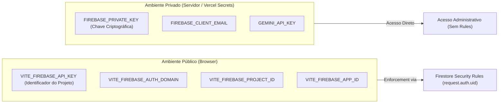

# SPEC Técnica: Integração Firebase (SmartTrip)

**Documento:** Especificação Técnica de Integração Backend & Persistência (Firebase Architecture Specification)  
**ID do Documento:** SPEC-FB-001  
**Versão:** 1.0.0  
**Data:** 2026-09-19  
**Status:** Aprovado para Implementação  
**Rastreabilidade:** Alinhado à [SPEC Mestre](../SPEC_MESTRE.md), [SPEC Operacional](SPEC_OPERACIONAL.md) e [SPEC de Interface](SPEC_INTERFACE.md)  

---

## 1. Visão Geral da Integração

O ecossistema **Firebase (Google Cloud)** provê a espinha dorsal de autenticação, persistência NoSQL em tempo real e segurança declarativa do **SmartTrip**. 

A arquitetura estabelece uma divisão rigorosa entre:
1. **Camada de Cliente (Firebase Client SDK):** Executada no navegador do usuário para autenticação reativa, leitura/escrita de itinerários e escuta de mudanças em tempo real, sempre intermediada e auditada pelas **Cloud Firestore Security Rules**.
2. **Camada de Servidor (Firebase Admin SDK):** Executada em ambiente controlado (Serverless / Server Actions / Cloud Functions) para operações com privilégios administrativos, tarefas agendadas e auditorias, operando com bypass das Security Rules e exigindo credenciais de conta de serviço estritamente privadas.

---

## 2. Comparativo Arquitetural: Client SDK vs. Admin SDK

| Dimensão | Firebase Client SDK (Web v10+) | Firebase Admin SDK (Node.js) |
| :--- | :--- | :--- |
| **Ambiente de Execução** | Navegador (Client-side / Browser) | Servidor (Node.js / Vercel Serverless / Edge) |
| **Pacote NPM** | `firebase` (módulos modulares `@firebase/*`) | `firebase-admin` |
| **Privilégios** | Limitados ao contexto do usuário autenticado | Superusuário / Acesso Irrestrito (*Bypass* de Rules) |
| **Mecanismo de Segurança** | **Obrigatório:** Firestore Security Rules | Credenciais de Conta de Serviço (Service Account) |
| **Exposição de Variáveis** | Variáveis públicas (prefixo `VITE_` ou `NEXT_PUBLIC_`) | Variáveis privadas de servidor (sem prefixo público) |
| **Casos de Uso no SmartTrip** | Login (Google/Email), CRUD de viagens pelo usuário, perfil | Geração em lote, webhooks de sincronização, triggers de IA |

---

## 3. Gestão de Variáveis e Ambientes

### 3.1 Classificação de Variáveis (Públicas vs. Privadas)



> [!CAUTION]
> **Regra de Ouro de Segurança:** A `FIREBASE_PRIVATE_KEY` e o arquivo `serviceAccountKey.json` **NUNCA** devem ser expostos ao cliente web ou versionados no Git. A chave pública do Client SDK (`VITE_FIREBASE_API_KEY`) serve apenas para rotear as requisições ao projeto Google Cloud correto e depende 100% das **Security Rules** para impedir acessos indevidos.

### 3.2 Matriz de Ambientes (Development / Preview / Production)

| Ambiente | Host / Plataforma | Estratégia de Isolamento | Projeto Firebase Recomendado |
| :--- | :--- | :--- | :--- |
| **Development (Local)** | `http://localhost:3000` | Firebase Local Emulator Suite ou Projeto Dev | `smarttrip-dev` (ou Emuladores locais) |
| **Preview (PR / Staging)** | Vercel Preview Deployments | Variáveis injetadas no ambiente Preview | `smarttrip-staging` |
| **Production** | Domínio de Produção | Variáveis de produção protegidas na Vercel | `smarttrip-prod` |

---

## 4. Inicialização Singleton e Prevenção de Instâncias Duplicadas

No ecossistema moderno com **Hot Module Replacement (HMR)** (como Vite e Next.js), módulos podem ser re-executados durante a edição do desenvolvedor sem recarregar a página inteira. Sem uma proteção do tipo Singleton, o Firebase emite o erro `FirebaseError: Firebase: Firebase App named '[DEFAULT]' already exists`.

### 4.1 Contrato de Inicialização do Client SDK
- Verificar se já existe uma instância ativa via `getApps().length`.
- Reutilizar a instância existente (`getApp()`) ou inicializar a primária (`initializeApp(firebaseConfig)`).
- Inicializar os serviços satélites (`getAuth`, `getFirestore`) garantindo que sejam exportados como singletons imutáveis.

### 4.2 Contrato de Inicialização do Admin SDK
- Verificar `admin.apps.length`.
- Se vazio, inicializar com `cert({ projectId, clientEmail, privateKey })`.
- Normalizar quebras de linha em chaves privadas (`privateKey.replace(/\\n/g, '\n')`).

---

## 5. Firebase Authentication

### 5.1 Métodos de Autenticação Suportados no MVP
1. **E-mail e Senha (`EmailAuthProvider`):**
   - Criação de conta (`createUserWithEmailAndPassword`).
   - Login com credenciais existentes (`signInWithEmailAndPassword`).
   - Redefinição segura de senha via e-mail (`sendPasswordResetEmail`).
2. **Google OAuth (`GoogleAuthProvider`):**
   - Login social interativo via Popup (`signInWithPopup`) com fallback para Redirect em mobile (`signInWithRedirect`).

### 5.2 Persistência de Sessão e Estado Reativo
- A persistência padrão configurada deve ser `browserLocalPersistence`, garantindo que o usuário permaneça autenticado entre abas e após o fechamento do navegador.
- O gerenciamento de estado do usuário na aplicação deve escutar o hook reativo `onAuthStateChanged`, mantendo o `currentUser` sincronizado e disparando carregamento de dados assim que o token JWT for emitido.
- O logout explícito (`signOut`) deve invalidar os tokens locais e redirecionar imediatamente o usuário para a tela inicial pública (`/`).

---

## 6. Cloud Firestore: Estrutura e Operações

### 6.1 Coleções e Contratos de Dados

#### Coleção `users` (`users/{userId}`)
Armazena o documento de perfil do usuário. O `userId` deve ser estritamente igual ao `auth.uid`.
- `uid`: string (ID do Auth)
- `email`: string
- `displayName`: string
- `photoURL`: string | null
- `homeCity`: string
- `preferences`: `{ styles: string[], pace: string, budget: string }`
- `createdAt`: `FieldValue.serverTimestamp()`
- `updatedAt`: `FieldValue.serverTimestamp()`

#### Coleção `trips` (`trips/{tripId}`)
Armazena os itinerários e viagens planejadas.
- `id`: string (auto-id do Firestore ou UUID prefixado)
- `userId`: string (chave estrangeira vinculada a `request.auth.uid`)
- `title`: string
- `destination`: string
- `country`: string
- `coverImage`: string
- `startDate`: string (`YYYY-MM-DD`)
- `endDate`: string (`YYYY-MM-DD`)
- `durationDays`: number
- `status`: `'draft' | 'saved' | 'archived'`
- `preferencesSnapshot`: objeto de preferências no momento da criação
- `weatherSummary`: objeto com médias meteorológicas e risco de chuva
- `itinerary`: array de dias contendo turnos e atividades
- `createdAt`: `FieldValue.serverTimestamp()`
- `updatedAt`: `FieldValue.serverTimestamp()`

#### Coleção `availabilities` (`users/{userId}/availabilities/{availabilityId}`)
Subcoleção ou coleção indexada por usuário para janelas de folga.
- `id`: string
- `userId`: string
- `title`: string
- `startDate`: string (`YYYY-MM-DD`)
- `endDate`: string (`YYYY-MM-DD`)
- `durationDays`: number
- `createdAt`: `FieldValue.serverTimestamp()`

---

## 7. Estratégia para Timestamps

> [!IMPORTANT]
> **Proibição de `new Date()` do Cliente:** Nunca utilize o relógio local da máquina do usuário para definir datas de criação ou auditoria no banco. Fuso-horários dessincronizados ou adulterados causam falhas graves em ordenações decrescentes de viagens.

### 7.1 Diretrizes Obrigatórias
- Em operações de criação: Utilizar sempre `serverTimestamp()` do Firestore para `createdAt` e `updatedAt`.
- Em operações de atualização: Atualizar exclusivamente o campo `updatedAt` com `serverTimestamp()`.
- Na camada de apresentação (UI): Converter os objetos `Timestamp` do Firestore para strings formatadas através de métodos utilitários (`timestamp.toDate().toLocaleDateString('pt-BR')`).

---

## 8. Firestore Security Rules (Requisito Obrigatório)

As regras de segurança constituem a barreira primária de defesa dos dados dos usuários. Nenhuma operação do Client SDK pode violar o isolamento por `request.auth.uid`.

### 8.1 Especificação Declarativa de Regras (`firestore.rules`)
```javascript
rules_version = '2';
service cloud.firestore {
  match /databases/{database}/documents {

    // Função utilitária de autenticação
    function isAuthenticated() {
      return request.auth != null;
    }

    // Validação de proprietário do documento
    function isOwner(userId) {
      return isAuthenticated() && request.auth.uid == userId;
    }

    // Regras para a coleção de Usuários
    match /users/{userId} {
      allow read: if isOwner(userId);
      allow create: if isOwner(userId) 
                    && request.resource.data.keys().hasAll(['email', 'displayName', 'createdAt']);
      allow update: if isOwner(userId)
                    && request.resource.data.diff(resource.data).affectedKeys().hasOnly(['displayName', 'photoURL', 'homeCity', 'preferences', 'updatedAt']);
      allow delete: if false; // Proibida exclusão de conta via client direto no MVP
    }

    // Regras para a coleção de Viagens
    match /trips/{tripId} {
      allow read: if isAuthenticated() && resource.data.userId == request.auth.uid;
      
      allow create: if isAuthenticated() 
                    && request.resource.data.userId == request.auth.uid
                    && request.resource.data.durationDays >= 1
                    && request.resource.data.durationDays <= 15;

      allow update: if isAuthenticated() 
                    && resource.data.userId == request.auth.uid
                    && request.resource.data.userId == request.auth.uid; // Impede transferência de posse

      allow delete: if isAuthenticated() && resource.data.userId == request.auth.uid;
    }

    // Regras para a subcoleção de Folgas
    match /users/{userId}/availabilities/{availabilityId} {
      allow read, write: if isOwner(userId);
    }
  }
}
```

---

## 9. Firebase Cloud Storage (Extensão Futura / Pós-MVP)

O Cloud Storage **NÃO** faz parte do núcleo crítico do MVP. O MVP operará utilizando URLs públicas de alta performance (Unsplash / Wikimedia Commons) referenciadas nos documentos Firestore.

### 9.1 Diretrizes para Extensão Futura
- **Uso Previsto:** Upload de fotos de perfil personalizadas e fotos capturadas pelo viajante durante o roteiro.
- **Estrutura de Pastas no Storage:**
  - `users/{userId}/avatar.{ext}`
  - `trips/{tripId}/photos/{photoId}.{ext}`
- **Security Rules do Storage:** Restringir upload a imagens (`image/*`), tamanho máximo de 5MB por arquivo e posse vinculada a `request.auth.uid`.

---

## 10. Módulos Conceituais e Responsabilidades

```text
src/lib/firebase/
├── config.ts              # Validação de variáveis de ambiente públicas do Firebase
├── client.ts              # Inicialização Singleton do App, Auth e Firestore
├── auth.ts                # Métodos encapsulados (loginEmail, loginGoogle, logout, resetPassword)
├── firestore/
│   ├── users.ts           # CRUD do perfil e preferências
│   ├── trips.ts           # Queries de viagens, persistência de roteiro, exclusão
│   └── availability.ts    # Gestão de períodos de folga
└── server/
    └── admin.ts           # Inicialização Singleton do Firebase Admin SDK (para endpoints de servidor)
```

### 10.1 Responsabilidades por Módulo
- `config.ts`: Valida a existência de `VITE_FIREBASE_API_KEY` e demais chaves antes da inicialização, lançando erros descritivos se alguma estiver vazia.
- `client.ts`: Aplica o padrão Singleton com `getApps()` / `initializeApp()`, exporta `auth` e `db`.
- `auth.ts`: Isola as chamadas do Firebase Auth, retornando promessas tipadas e tratando códigos de erro comuns (`auth/user-not-found`, `auth/wrong-password`).
- `firestore/trips.ts`: Converte snapshots em modelos fortemente tipados em TypeScript, gerencia listeners `onSnapshot` para atualização em tempo real e insere `serverTimestamp()`.

---

## 11. Riscos e Mitigações

| Risco Técnico | Probabilidade | Impacto | Estratégia de Mitigação |
| :--- | :---: | :---: | :--- |
| **Vazamento de Credenciais de Admin** | Baixa | Crítico | Chaves de conta de serviço nunca acessadas no client; auditoria automatizada de segredos no repositório. |
| **Acesso Não Autorizado a Viagens Alheias** | Média | Alto | Bloqueio compulsório via Firestore Security Rules checando `resource.data.userId == request.auth.uid`. |
| **Inconsistência de Datas/Horários** | Alta | Médio | Uso estrito de `serverTimestamp()` para auditoria e strings `YYYY-MM-DD` para datas de calendário. |
| **Erros de Inicialização com HMR no Vite** | Alta | Baixo | Uso do padrão `getApps().length ? getApp() : initializeApp(...)`. |
| **Custo por Leituras Excessivas no Firestore** | Média | Médio | Paginação de viagens, queries com `limit()`, e cache local offline habilitado no client. |

---

## 12. Estratégia de Testes

### 12.1 Testes Unitários de Regras de Segurança (`rules-unit-testing`)
- **Ferramenta:** `@firebase/rules-unit-testing` executado contra o Firebase Local Emulator Suite.
- **Cenários Testados:**
  - Usuário não autenticado tentando ler `/trips/trip1` ➔ **Bloqueado (Permission Denied)**.
  - Usuário `user_A` tentando ler documento pertencente a `user_B` ➔ **Bloqueado**.
  - Usuário `user_A` gravando viagem com `durationDays = 20` ➔ **Bloqueado (RN-001)**.
  - Usuário `user_A` gravando viagem válida com `userId = user_A` ➔ **Permitido**.

### 12.2 Testes de Integração de Autenticação
- Simulação de ciclo completo de autenticação contra o Emulador de Auth:
  - Registro de novo usuário ➔ Verificação da criação automática do documento em `users/{userId}`.
  - Logout ➔ Verificação de `currentUser == null`.

---

## 13. Critérios de Aceite da Integração (CA-FB)

* **CA-FB-001 (Singleton do Client):** Múltiplas importações de `src/lib/firebase/client.ts` não devem disparar erro de aplicativo Firebase duplicado.
* **CA-FB-002 (Proteção de Segredos):** Nenhuma variável de ambiente contendo chave privada ou token administrativo deve estar acessível no bundle cliente.
* **CA-FB-003 (Sessão Persistente):** O recarregamento de página em rotas privadas (`/dashboard`, `/trips`) deve manter a sessão do usuário ativa sem forçar novo login.
* **CA-FB-004 (Persistência com Timestamps do Servidor):** Toda viagem salva no Firestore deve conter campos `createdAt` e `updatedAt` gerados por `serverTimestamp()`.
* **CA-FB-005 (Isolamento por Regras):** É mandatório que o arquivo `firestore.rules` esteja presente na raiz do projeto e seja validado sem exceções.
* **CA-FB-006 (Tratamento Gracioso de Erros):** Falhas de rede ou recusa de permissão pelo Firestore devem ser capturadas por blocos `try/catch` e exibidas como feedback visual amigável (Toast/ErrorState) sem crashar a interface.
