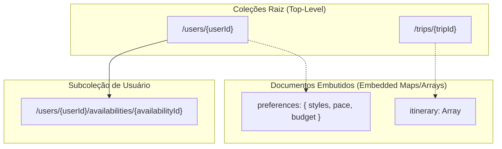

# SPEC de Modelagem de Dados do Cloud Firestore (SmartTrip)

**Documento:** Modelagem Conceitual e Física NoSQL do Firestore (Firestore Schema & Data Access Specification)  
**ID do Documento:** SPEC-DATA-001  
**Versão:** 1.0.0  
**Data:** 2026-09-19  
**Status:** Aprovado para Implementação  
**Rastreabilidade:** Alinhado à [SPEC Mestre](../SPEC_MESTRE.md), [SPEC Firebase](SPEC_FIREBASE.md) e [SPEC Autenticação](SPEC_AUTH.md)  

---

## 1. Decisões Arquiteturais NoSQL: Coleção Raiz vs. Subcoleção vs. Embedded

A modelagem de dados no Cloud Firestore é orientada pelos padrões de acesso da interface e pela otimização de **custo de leitura/escrita** (cobrança por documento) e **latência de rede**:



### 1.1 Análise Justificada por Entidade

| Entidade | Estratégia Adotada | Justificativa Técnica NoSQL |
| :--- | :--- | :--- |
| **`users`** | **Coleção Raiz** | Identidade global indexada pelo `uid` do Firebase Auth. Permite busca direta em O(1) e regras de segurança simples. |
| **`preferences`** | **Embedded Map em `users`** | O perfil e as preferências são **sempre lidos juntos** na inicialização da aplicação. Embutir evita duplicar leituras no Firestore (1 leitura ao invés de 2) e consome menos de 0.5 KB do limite de 1 MB por documento. |
| **`availability`** | **Subcoleção de `users`** | As folgas pertencem exclusivamente àquele viajante e não possuem relevância pública. A subcoleção isola o ciclo de vida e previne que o documento do usuário cresça indefinidamente. |
| **`trips`** | **Coleção Raiz com `userId`** | Decisão fundamental para escalabilidade: permite consultar as viagens do usuário via query indexada e, no pós-MVP, viabiliza **compartilhamento público** via link direto (`/trips/{tripId}`) sem expor a árvore do usuário. |
| **`itineraryItems`** | **Embedded Array em `trips`** | No MVP, viagens têm de 1 a 15 dias (~30 atividades no total). O payload JSON completo da viagem atinge entre **20 KB e 45 KB** (muito abaixo do teto de 1 MB do Firestore). Embutir reduz o custo de visualização de 31 leituras (1 viagem + 30 atividades) para **exatamente 1 leitura**, garantindo atualizações atômicas e edição offline simplificada. |

---

## 2. Modelagem Detalhada das Entidades

---

### 2.1 Entidade: `users` (Perfil do Viajante)

* **Caminho:** `/users/{userId}` (onde `{userId}` é estritamente igual ao `request.auth.uid`).
* **Proprietário:** Usuário autenticado detentor do `uid`.
* **Timestamps:** `createdAt` (na criação) e `updatedAt` (na edição), ambos gerados via `serverTimestamp()`.
* **Risco de Duplicação & Idempotência:** Zero risco. Como o ID do documento é o próprio `uid` do Auth, tentativas de gravação repetida usam `setDoc(ref, data, { merge: true })` ou validação prévia de existência.

#### Tabela de Campos
| Campo | Tipo Firestore | Obrigatório? | Descrição / Restrições |
| :--- | :--- | :---: | :--- |
| `uid` | `string` | Sim | Identificador exclusivo idêntico ao `request.auth.uid`. |
| `email` | `string` | Sim | E-mail do usuário validado pelo Auth. |
| `displayName` | `string` | Sim | Nome completo de exibição. |
| `photoURL` | `string \| null` | Não | URL do avatar do usuário. |
| `homeCity` | `string` | Sim | Cidade base do viajante (padrão: "São Paulo, SP"). |
| `role` | `string` | Sim | Papel RBAC: obrigatoriamente `'user'` na criação; mutação proibida no client. |
| `preferences` | `map` | Sim | Mapa com as preferências padrão de viagem (ver 2.2). |
| `createdAt` | `timestamp` | Sim | Timestamp gerado pelo servidor na criação. |
| `updatedAt` | `timestamp` | Sim | Timestamp gerado pelo servidor na última alteração. |

#### Exemplo de Documento (`/users/usr_larissa_001`)
```json
{
  "uid": "usr_larissa_001",
  "email": "larissa.mendes@email.com",
  "displayName": "Larissa Mendes",
  "photoURL": "https://images.unsplash.com/photo-1494790108377-be9c29b29330?w=200&h=200&fit=crop&crop=face",
  "homeCity": "São Paulo, SP",
  "role": "user",
  "preferences": {
    "styles": ["Gastronomia", "Cultura", "Caminhadas Urbanas"],
    "pace": "moderado",
    "budget": "moderado"
  },
  "createdAt": "2026-09-19T10:00:00.000Z",
  "updatedAt": "2026-09-19T10:05:00.000Z"
}
```

#### Consultas Previstas
* Leitura de perfil por ID: `getDoc(doc(db, 'users', uid))` (Custo: 1 leitura).

#### Estratégia de Exclusão
* Exclusão proibida diretamente no client (`allow delete: if false`). Casos de encerramento de conta ocorrem exclusivamente via endpoint de servidor (Admin SDK) para garantir expurgo em conformidade com LGPD.

---

### 2.2 Entidade: `preferences` (Preferências de IA)

Esta entidade é modelada como um **Embedded Map** obrigatório dentro do documento de `users`.

#### Tabela de Campos
| Campo | Tipo Firestore | Obrigatório? | Descrição / Valores Válidos |
| :--- | :--- | :---: | :--- |
| `styles` | `array<string>` | Sim | Array com ao menos 1 estilo (ex: `["Gastronomia", "Cultura"]`). |
| `pace` | `string` | Sim | Valores permitidos: `'tranquilo'`, `'moderado'`, `'intenso'`. |
| `budget` | `string` | Sim | Valores permitidos: `'economico'`, `'moderado'`, `'luxo'`. |

---

### 2.3 Entidade: `availability` (Períodos de Folga e Feriados)

* **Caminho:** `/users/{userId}/availabilities/{availabilityId}`
* **Proprietário:** O usuário pai identificado por `userId == request.auth.uid`.
* **Timestamps:** `createdAt` (`serverTimestamp()`).
* **Risco de Duplicação:** Controlado por auto-id (`doc(collection(...))`). Janelas idênticas podem ser validadas no cliente antes do envio.

#### Tabela de Campos
| Campo | Tipo Firestore | Obrigatório? | Descrição |
| :--- | :--- | :---: | :--- |
| `id` | `string` | Sim | Identificador único do período de folga. |
| `userId` | `string` | Sim | Chave estrangeira de redundância (`userId == auth.uid`). |
| `title` | `string` | Sim | Nome descritivo (ex: "Feriado Tiradentes Prolongado"). |
| `startDate` | `string` | Sim | Formato ISO `YYYY-MM-DD`. |
| `endDate` | `string` | Sim | Formato ISO `YYYY-MM-DD` (`endDate >= startDate`). |
| `durationDays` | `number` | Sim | Quantidade de dias calculada inclusiva (ex: 4). |
| `createdAt` | `timestamp` | Sim | Data de registro no Firestore. |

#### Exemplo de Documento (`/users/usr_larissa_001/availabilities/av_tiradentes_2026`)
```json
{
  "id": "av_tiradentes_2026",
  "userId": "usr_larissa_001",
  "title": "Feriado Tiradentes Prolongado",
  "startDate": "2026-04-21",
  "endDate": "2026-04-24",
  "durationDays": 4,
  "createdAt": "2026-09-19T10:15:00.000Z"
}
```

#### Consultas Previstas
* Listar folgas do usuário ordenadas por data de início:
  ```typescript
  query(
    collection(db, 'users', uid, 'availabilities'),
    orderBy('startDate', 'asc')
  );
  ```

#### Estratégia de Exclusão
* Exclusão física direta pelo proprietário: `deleteDoc(doc(db, 'users', uid, 'availabilities', id))`.

---

### 2.4 Entidade: `trips` (Roteiros de Viagem)

* **Caminho:** `/trips/{tripId}`
* **Proprietário:** `userId` (gravado no documento e validado com `request.auth.uid`).
* **Timestamps:** `createdAt` e `updatedAt` (`serverTimestamp()`).
* **Risco de Duplicação:** Minimizada por UUID ou `auto-id` gerado na criação do rascunho (`draft`).

#### Tabela de Campos
| Campo | Tipo Firestore | Obrigatório? | Descrição / Restrições |
| :--- | :--- | :---: | :--- |
| `id` | `string` | Sim | Identificador único da viagem. |
| `userId` | `string` | Sim | Identificador do proprietário (deve bater com `request.auth.uid`). |
| `title` | `string` | Sim | Título do roteiro (ex: "Escapada Cultural em Montevidéu"). |
| `destination` | `string` | Sim | Nome da cidade principal. |
| `country` | `string` | Sim | País do destino. |
| `coverImage` | `string` | Sim | URL da imagem de capa. |
| `startDate` | `string` | Sim | Data de início em `YYYY-MM-DD`. |
| `endDate` | `string` | Sim | Data de término em `YYYY-MM-DD`. |
| `durationDays` | `number` | Sim | Inteiro de 1 a 15 (conforme RN-001 da SPEC mestre). |
| `status` | `string` | Sim | `'draft'` (em revisão) ou `'saved'` (confirmado). |
| `preferencesSnapshot` | `map` | Sim | Cópia estática das preferências aplicadas nesta geração. |
| `weatherSummary` | `map` | Sim | `{ avgTemp: number, hasRainRisk: boolean, mainCondition: string }`. |
| `itinerary` | `array<map>` | Sim | Array cronológico com os dias da viagem e atividades (ver 2.5). |
| `createdAt` | `timestamp` | Sim | Data de criação no Firestore. |
| `updatedAt` | `timestamp` | Sim | Data da última alteração humana ou da IA. |

#### Exemplo de Documento (`/trips/trip_mvd_2026`)
```json
{
  "id": "trip_mvd_2026",
  "userId": "usr_larissa_001",
  "title": "Escapada Cultural em Montevidéu",
  "destination": "Montevidéu",
  "country": "Uruguai",
  "coverImage": "https://images.unsplash.com/photo-1596422846543-75c6fc197f07?w=1000&fit=crop",
  "startDate": "2026-10-10",
  "endDate": "2026-10-13",
  "durationDays": 4,
  "status": "saved",
  "preferencesSnapshot": {
    "styles": ["Gastronomia", "Cultura"],
    "pace": "moderado",
    "budget": "moderado"
  },
  "weatherSummary": {
    "avgTemp": 19,
    "hasRainRisk": true,
    "mainCondition": "Parcialmente Nublado com chuva leve no dia 2"
  },
  "itinerary": [
    {
      "dayIndex": 1,
      "date": "2026-10-10",
      "weather": {
        "tempMin": 14,
        "tempMax": 22,
        "rainProbability": 15,
        "condition": "Ensolarado"
      },
      "activities": [
        {
          "id": "act_101",
          "period": "morning",
          "time": "09:30",
          "title": "Caminhada pela Ciudad Vieja e Puerta de la Ciudadela",
          "description": "Exploração a pé dos monumentos históricos centrais.",
          "category": "cultural",
          "estimatedCost": "gratis",
          "weatherTip": "Manhã clara e ensolarada, ideal para fotografias ao ar livre.",
          "isCustom": false
        }
      ]
    }
  ],
  "createdAt": "2026-09-19T10:20:00.000Z",
  "updatedAt": "2026-09-19T10:25:00.000Z"
}
```

#### Consultas Previstas
1. **Listar viagens do usuário ordenadas por criação decrescente:**
   ```typescript
   query(
     collection(db, 'trips'),
     where('userId', '==', uid),
     orderBy('createdAt', 'desc')
   );
   ```
2. **Filtrar viagens do usuário por status:**
   ```typescript
   query(
     collection(db, 'trips'),
     where('userId', '==', uid),
     where('status', '==', 'saved'),
     orderBy('createdAt', 'desc')
   );
   ```
3. **Buscar uma viagem específica por ID:**
   ```typescript
   getDoc(doc(db, 'trips', tripId));
   ```

#### Estratégia de Exclusão
* **Exclusão Física:** A exclusão de uma viagem via interface remove o documento de `/trips/{tripId}`. Como os `itineraryItems` estão embutidos dentro do documento, a remoção é **atômica e imediata**, eliminando o risco de "itens órfãos" sem necessidade de jobs de limpeza em segundo plano.

---

### 2.5 Entidade: `itineraryItems` (Atividades do Itinerário)

Modelada como um array de objetos dentro do campo `itinerary` do documento `trips`.

#### Estrutura do Objeto `DayPlan`
- `dayIndex`: `number` (1, 2, 3...)
- `date`: `string` (`YYYY-MM-DD`)
- `weather`: `{ tempMin: number, tempMax: number, rainProbability: number, condition: string }`
- `activities`: `array<ActivityItem>`

#### Estrutura do Objeto `ActivityItem`
| Campo | Tipo | Obrigatório? | Descrição |
| :--- | :--- | :---: | :--- |
| `id` | `string` | Sim | Identificador exclusivo da atividade (ex: `act_101`). |
| `period` | `string` | Sim | `'morning'` \| `'afternoon'` \| `'evening'`. |
| `time` | `string` | Sim | Horário sugerido (ex: `"09:30"`). |
| `title` | `string` | Sim | Título da atração ou atividade. |
| `description` | `string` | Sim | Descrição contextual gerada pelo Gemini ou editada pelo humano. |
| `category` | `string` | Sim | `'cultural'` \| `'gastronomia'` \| `'natureza'` \| `'lazer'`. |
| `estimatedCost` | `string` | Sim | `'gratis'` \| `'$'` \| `'$$'` \| `'$$$'`. |
| `weatherTip` | `string` | Não | Dica de clima alinhada ao tempo previsto naquele dia. |
| `isCustom` | `boolean` | Não | `true` se foi inserida manualmente pelo usuário na revisão humana. |

---

## 3. Matriz de Autorização por Entidade

A matriz detalha as permissões concedidas em cada operação e o enforcement obrigatório nas **Firestore Security Rules**:

| Entidade | Visitante Anônimo | Usuário Autenticado (Proprietário) | Usuário Autenticado (Terceiro) | Administrador do Sistema |
| :--- | :---: | :---: | :---: | :---: |
| **`users/{userId}`** | ❌ Negado | ✅ **CRUD** (exceto Delete e mutação de `role`) | ❌ Negado | ✅ **CRUD Total** (via Admin SDK) |
| **`users/.../availabilities`** | ❌ Negado | ✅ **CRUD Total** | ❌ Negado | ✅ **CRUD Total** |
| **`trips/{tripId}`** | ❌ Negado (MVP) | ✅ **CRUD Total** (1 a 15 dias) | ❌ Negado | ✅ **CRUD Total** |
| **`itineraryItems`** *(embutidos em trips)*| ❌ Negado | ✅ **CRUD Total** (via doc pai) | ❌ Negado | ✅ **CRUD Total** |

---

## 4. Índices Compostos Esperados (`firestore.indexes.json`)

Para suportar as consultas compostas com `where` e `orderBy` simultâneos, o Firestore exige os seguintes índices compostos:

```json
{
  "indexes": [
    {
      "collectionGroup": "trips",
      "queryScope": "COLLECTION",
      "fields": [
        { "fieldPath": "userId", "order": "ASCENDING" },
        { "fieldPath": "createdAt", "order": "DESCENDING" }
      ]
    },
    {
      "collectionGroup": "trips",
      "queryScope": "COLLECTION",
      "fields": [
        { "fieldPath": "userId", "order": "ASCENDING" },
        { "fieldPath": "status", "order": "ASCENDING" },
        { "fieldPath": "createdAt", "order": "DESCENDING" }
      ]
    },
    {
      "collectionGroup": "availabilities",
      "queryScope": "COLLECTION",
      "fields": [
        { "fieldPath": "userId", "order": "ASCENDING" },
        { "fieldPath": "startDate", "order": "ASCENDING" }
      ]
    }
  ],
  "fieldOverrides": []
}
```
