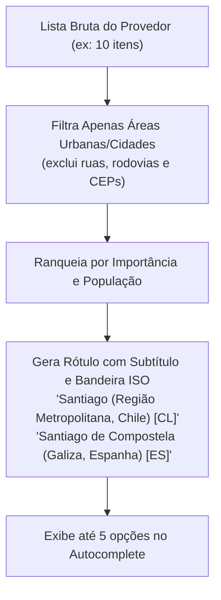

# SPEC: Serviço de Busca e Normalização de Destinos (SmartTrip)

**Documento:** Especificação Funcional e Técnica da Camada de Geocodificação  
**ID do Documento:** SPEC-GEO-001  
**Versão:** 1.0.0  
**Data:** 2026-09-19  
**Status:** Aprovado para Implementação  
**Rastreabilidade:** Alinhado à [SPEC Mestre](../SPEC_MESTRE.md), [SPEC Interface](SPEC_INTERFACE.md) e [SPEC Disponibilidade e Preferências](SPEC_DISPONIBILIDADE_PREFERENCIAS.md)  

---

## 1. Objetivo e Visão Geral

O objetivo deste serviço é **converter qualquer texto livre digitado pelo usuário** (ex: *"santiago"*, *"rio de janeiro"*, *"gramado"*, *"paris"*) em uma **entidade geográfica canônica, normalizada e unívoca** contendo coordenadas geográficas precisas (latitude e longitude), cidade, divisão administrativa/estado, país e código ISO 3166-1 alpha-2.

Esta entidade normalizada é o **ponto de ancoragem de todo o ecossistema SmartTrip**:
1. **API de Meteorologia (Open-Meteo):** Exige `latitude` e `longitude` exatas em formato decimal para fornecer previsões de chuva, temperatura e vento.
2. **Motor de IA (Google Gemini 2.5):** Recebe o nome canônico (`city`, `state`, `country`) para fundamentar a montagem de roteiros e POIs locais.
3. **Persistência de Viagens (`trips`):** Armazena a localização normalizada, evitando inconsistências como *"Rio"*, *"RJ"*, *"Rio de Janeiro - Brasil"*.

```mermaid
flowchart TD
    UserInput["Texto Livre do Usuário<br/>(ex: 'santiago')"] --> Debounce["Debounce Controller<br/>(350ms + min 3 chars)"]
    Debounce --> CacheCheck{"Está no Cache?<br/>(Memory / LocalStorage)"}
    CacheCheck -->|Sim (Hit)| ReturnNormalized["Retorna NormalizedDestination[]"]
    CacheCheck -->|Não (Miss)| Throttle["Rate Limiter & Quota Guard<br/>(1 req/seg)"]
    Throttle --> AbortCtrl["AbortController<br/>(Timeout 4000ms)"]
    AbortCtrl --> ProviderAdapter["Geocoding Provider Adapter<br/>(Nominatim / Photon / Google)"]
    ProviderAdapter --> Normalizer["Normalizador Canônico<br/>(Schema Transformer)"]
    Normalizer --> CacheStore["Armazena no Cache (TTL 24h)"]
    CacheStore --> ReturnNormalized
    ReturnNormalized --> DropdownUI["Dropdown com Desambiguação<br/>(Chile vs Espanha vs RS)"]
```

---

## 2. Contrato de Entrada e Regras de Digitação

### 2.1 Entrada Bruta e Sanitização
* **Tipo:** `string`.
* **Sanitização Obrigatória:**
  1. `trim()` em espaços no início e final.
  2. Remoção de caracteres de controle e quebras de linha (`\n`, `\r`, `\t`).
  3. Normalização Unicode via `String.prototype.normalize('NFC')` para preservar acentuação padrão internacional sem fragmentação de grafemas.
  4. Sanitização contra injeção de HTML/scripts (mitigação de XSS no render do autocomplete).

### 2.2 Limite Mínimo de Caracteres
* **Regra:** A busca remota **só é acionada quando o texto sanitizado tiver $\ge 3$ caracteres**.
* **Comportamento para $< 3$ caracteres:**
  - Nenhuma requisição HTTP é emitida.
  - O dropdown de resultados remotos é ocultado ou, opcionalmente, exibe sugestões populares pré-carregadas (ex: Montevidéu, Buenos Aires, Paraty, Gramado).
  - Qualquer busca anterior ainda em trânsito é imediatamente abortada.

### 2.3 Debounce e Cancelamento de Requisições em Trânsito (*In-Flight*)
* **Janela de Debounce:** **350 ms**.
* **Justificativa:** 350 ms é o intervalo ideal que equilibra percepção de resposta instantânea pelo usuário e prevenção de consumo excessivo de cota ou bloqueio por IP (*rate limit* de servidores públicos).
* **AbortController Obligatório:**
  - Cada nova chamada cancela a requisição anterior através de `abortController.abort()`.
  - Evita **Race Conditions** onde uma resposta demorada de uma pesquisa anterior (ex: *"par"*) sobrescreve uma resposta mais rápida e atualizada (ex: *"paraty"*).

---

## 3. Contrato Interno Independente de Provedor (Adapter Pattern)

Para garantir que o SmartTrip não fique acoplado a um fornecedor específico (como Nominatim, OpenStreetMap, Photon, Mapbox ou Google Places), a arquitetura adota o **Padrão Adapter**. A aplicação interage exclusivamente com a interface conceitual:

### 3.1 Interface do Serviço (`IGeocodingService`)

```typescript
export interface GeocodingCoordinates {
  latitude: number;  // Entre -90.0 e +90.0
  longitude: number; // Entre -180.0 e +180.0
}

export interface NormalizedDestination {
  id: string;                  // Identificador canônico estável (ex: 'geo_osm_12345')
  city: string;                // Nome da cidade (ex: 'Santiago')
  state?: string;              // Estado, Província ou Região (ex: 'Região Metropolitana de Santiago')
  country: string;             // Nome do país em português (ex: 'Chile')
  countryCode: string;         // ISO 3166-1 alpha-2 em maiúsculas (ex: 'CL', 'BR', 'UY')
  displayName: string;         // Rótulo completo formatado (ex: 'Santiago, Região Metropolitana, Chile')
  coordinates: GeocodingCoordinates;
  rawType: 'city' | 'town' | 'village' | 'administrative' | 'destination';
  importance: number;          // Relevância geográfica (score 0.0 a 1.0)
  boundingBox?: [number, number, number, number]; // [minLat, maxLat, minLon, maxLon]
}

export interface GeocodingSearchOptions {
  limit?: number;              // Padrão: 5 resultados
  language?: string;           // Padrão: 'pt-BR,pt;q=0.9,en;q=0.8'
  countryCodes?: string[];     // Opcional para restringir países (ex: ['br', 'uy', 'ar', 'cl'])
  signal?: AbortSignal;
}

export interface IGeocodingProvider {
  name: string;
  search(query: string, options?: GeocodingSearchOptions): Promise<NormalizedDestination[]>;
}
```

---

## 4. Normalização e Validação de Coordenadas

### 4.1 Schema de Latitude e Longitude
As coordenadas são rigorosamente convertidas em números de ponto flutuante (*float*):
* $\text{Latitude} \in [-90.000000, +90.000000]$
* $\text{Longitude} \in [-180.000000, +180.000000]$
* Arredondamento normalizado: **até 6 casas decimais** (resolução submétrica de ~0,1 metro, mais que suficiente para o planejamento de viagens urbanas).

### 4.2 Tabela de Atributos Normalizados
| Campo | Tipo | Obrigatório | Descrição / Exemplo |
| :--- | :--- | :---: | :--- |
| `id` | `string` | Sim | Identificador unívoco composto (`geo_` + provedor + id externo). |
| `city` | `string` | Sim | Nome oficial da cidade (ex: `"Gramado"`, `"Montevidéu"`). |
| `state` | `string` | Não | Província/Estado (ex: `"Rio Grande do Sul"`, `"Montevideo"`). |
| `country` | `string` | Sim | Nome do país traduzido (ex: `"Brasil"`, `"Uruguai"`). |
| `countryCode`| `string` | Sim | Código ISO de 2 letras em caixa alta (ex: `"BR"`, `"UY"`). |
| `displayName`| `string` | Sim | Rótulo formatado para exibição no autocomplete. |
| `coordinates.latitude` | `number` | Sim | Float entre -90 e 90. |
| `coordinates.longitude` | `number` | Sim | Float entre -180 e 180. |
| `importance` | `number` | Sim | Score normalizado entre 0 e 1 para ordenação. |

---

## 5. Seleção entre Resultados Ambíguos (Desambiguação)

Quando o usuário pesquisa por termos comuns a múltiplas localidades (ex: *"Santiago"*, *"São Carlos"*, *"Valência"*), o serviço adota um pipeline determinístico de desambiguação:



### Regras de Interface (UX):
1. **Destaque Tipográfico:**
   - Linha 1 (Negrito): Nome da Cidade (ex: **Santiago**).
   - Linha 2 (Secundário/Discreto): Estado, País e Sigla (ex: *Região Metropolitana de Santiago, Chile [CL]*).
2. **Badge Visual:** Código do país (`CL`, `ES`, `BR`) com bandeira contextual ou ícone de globo.
3. **Seleção Mandatória:** O sistema não infere arbitrariamente a cidade se houver ambiguidade; o clique explícito do usuário confirma a entidade e fixa as coordenadas para a chamada da previsão do tempo.

---

## 6. Tratamento de Destino Inexistente (Empty State)

Caso a consulta retorne 0 resultados (ex: *"xxyyzz123"*, *"asdfghjkl"*):
* **Não quebrar a tela:** A interface intercepta a lista vazia sem emitir alertas intrusivos ou erros de console.
* **Componente de Feedback Amigável:**
  - Ícone de mapa com lupa ou ponto de interrogação.
  - Mensagem: *"Nenhum destino encontrado para '{query}'. Verifique a grafia ou tente incluir o país."*
* **Sugestões Rápidas de Destinos (Fallback):**
  - Exibição de chips com destinos em destaque: **[Montevidéu]**, **[Buenos Aires]**, **[Paraty]**, **[Gramado]**, **[Santiago]**.
  - O clique em qualquer chip preenche imediatamente a busca e resolve a localização.

---

## 7. Timeout, Resiliência e Rate Limiting

### 7.1 Timeout
* **Limite Máximo:** **4.000 ms (4 segundos)**.
* **Mecanismo:** `AbortSignal.timeout(4000)`.
* **Tratamento de Exceção:** Caso o servidor de geocodificação não responda em 4 segundos, a busca é cancelada graciosamente e a UI exibe: *"Tempo limite excedido ao buscar destino. Tente novamente."* com botão de reintento.

### 7.2 Cache de Resultados
Para proteger quotas de requisição e entregar resposta com latência próxima de $0\text{ ms}$:
* **Nível 1 (Memória - LRU Cache):**
  - Capacidade: 100 consultas mais recentes.
  - Duração: Sessão ativa.
* **Nível 2 (Armazenamento Local - `localStorage`):**
  - Chave de cache: `smarttrip_geo_cache_{query_normalizada}`.
  - Chave normalizada: letras minúsculas, sem espaços extras (ex: `"  RIO  DE JANEIRO "` $\to$ `"rio de janeiro"`).
  - **TTL (Time to Live):** **24 horas** (localizações geográficas raramente mudam).
  - Auto-limpeza quando o storage estiver próximo de 5MB.

### 7.3 Rate Limiting e Proteção de Quota do Provedor
* **Nominatim / OpenStreetMap Usage Policy:**
  - Máximo de **1 requisição por segundo** por cliente.
  - Implementação de um semáforo/fila (*token bucket / throttler*) na camada do Adapter.
  - Envio compulsório do cabeçalho `User-Agent: SmartTrip-TravelPlanner/1.0 (marcus@smarttrip.local)`.

---

## 8. Privacidade e Segurança (Zero-PII)

* **Queries Anônimas:** A requisição enviada aos serviços de geocodificação contém **estritamente o termo de busca textual**.
* **Zero Dados Pessoais (Zero-PII):** NUNCA incluir cabeçalhos com `Authorization`, `UID` de usuário, e-mail, cookies de sessão ou parâmetros de perfil nas URLs de busca externa.
* **Conformidade LGPD/GDPR:** Localizações pesquisadas não são vinculadas a perfis no provedor externo de mapas.

---

## 9. Critérios de Aceite Globais (`CA-GEO`)

| ID | Critério | Cenário de Teste / Verificação |
| :--- | :--- | :--- |
| **`CA-GEO-001`** | **Tamanho Mínimo de Entrada** | Digitar 1 ou 2 caracteres não emite requisição HTTP de geocodificação. A partir do 3º caractere sanitizado, a busca é ativada. |
| **`CA-GEO-002`** | **Debounce Temporal** | Digitações rápidas em sequência (ex: "p", "pa", "par", "pari", "paris" em menos de 300ms) disparam apenas 1 única requisição após 350ms de pausa. |
| **`CA-GEO-003`** | **Cancelamento de Requisição Anterior** | Mudar o termo enquanto uma requisição está ativa cancela a anterior via `AbortController` sem gerar erro não-tratado. |
| **`CA-GEO-004`** | **Contrato Normalizado de Saída** | O objeto retornado atende integralmente à interface `NormalizedDestination`, contendo `city`, `country`, `countryCode`, `displayName` e `coordinates`. |
| **`CA-GEO-005`** | **Coordenadas Numéricas Válidas** | `coordinates.latitude` está no intervalo $[-90.0, 90.0]$ e `coordinates.longitude` está no intervalo $[-180.0, 180.0]$, ambos do tipo `number`. |
| **`CA-GEO-006`** | **Desambiguação Clara** | Buscar "Santiago" exibe lista com opções discriminando Chile vs Espanha com país e estado legíveis. |
| **`CA-GEO-007`** | **Destino Inexistente** | Buscar termos aleatórios sem correspondência geográfica retorna array vazio `[]` e exibe componente com sugestões de destinos populares. |
| **`CA-GEO-008`** | **Timeout de 4 Segundos** | Respostas que excedam 4000ms são abortadas com mensagem amigável de erro sem travar a interface. |
| **`CA-GEO-009`** | **Cache em Dois Níveis** | Repetir a mesma busca dentro da mesma sessão retorna os dados do cache em $< 10\text{ ms}$ sem nova requisição de rede. |
| **`CA-GEO-010`** | **Isolamento de Provedor** | Trocar o provedor no Adapter (ex: Mock para Nominatim ou Photon) não altera a assinatura de resposta consumida pelas telas. |

---

## 10. Matriz de Testes Automatizados Previstos

A suíte de testes do serviço (`scripts/verify-geocoding.mjs`) cobrirá:
1. **Sanitização de query:** espaços múltiplos, caracteres especiais, tags script.
2. **Regra de 3 caracteres:** rejeição de 0, 1 e 2 caracteres.
3. **Cálculo de Debounce:** temporizador simulado.
4. **Validação de coordenadas:** checagem matemática de limites globais.
5. **Conversão de schema:** validação de campos obrigatórios (`city`, `country`, `countryCode`, `displayName`).
6. **Desambiguação:** ordenação por relevância.
7. **Cache hit vs miss:** validação de armazenamento e retorno imediato.
8. **Timeout com AbortController:** simulação de rede lenta com rejeição pontual aos 4000ms.
9. **Zero PII:** garantia de ausência de credenciais nas requisições.
