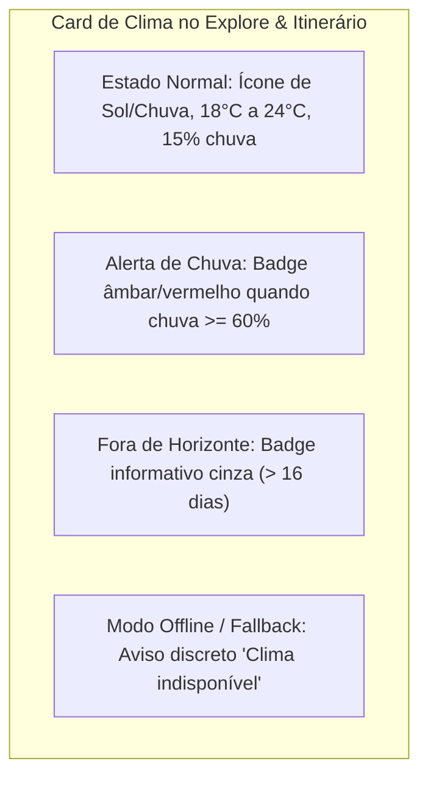

# SPEC: Serviço Meteorológico do SmartTrip

**Documento:** Especificação Funcional e Técnica da Camada Meteorológica  
**ID do Documento:** SPEC-METEO-001  
**Versão:** 1.0.0  
**Data:** 2026-09-19  
**Status:** Aprovado para Implementação  
**Rastreabilidade:** Alinhado à [SPEC Mestre](../SPEC_MESTRE.md) (RF-002, RN-003, RN-004), [SPEC Geocodificação](SPEC_GEOCODING_DESTINOS.md) e [SPEC Interface](SPEC_INTERFACE.md)  

---

## 1. Objetivo e Visão Geral

O **Serviço Meteorológico do SmartTrip** tem a missão de obter, normalizar e fornecer previsões climáticas diárias confiáveis para o destino pretendido pelo viajante, a partir de coordenadas geográficas exatas (`latitude`, `longitude`) e de uma janela temporal delimitada (`startDate`, `endDate`).

Este serviço atua como **pilar central de contextualização** para:
1. **O Motor de Inteligência Artificial (Google Gemini 2.5 Flash):** Fornece dados reais de temperatura e precipitação para que a IA cumpra compulsoriamente a **RN-004** (agendar atrações ao ar livre em dias ensolarados e transferir atividades para museus, gastronomia e locais cobertos em dias de chuva).
2. **A Experiência do Usuário (UX):** Apresenta ao viajante um resumo meteorológico claro com alertas de chuva, amplitude térmica diária e sugestões de vestuário.

```mermaid
flowchart TD
    Coordenadas["Coordenadas do Destino<br/>(lat, lng, startDate, endDate)"] --> DateCheck{"As datas estão dentro do<br/>horizonte de 16 dias?"}
    DateCheck -->|Sim (Dentro do Horizonte)| CacheCheck{"Está no Cache?<br/>(TTL 3h)"}
    DateCheck -->|Não (> 16 dias)| OutOfHorizon["Representa Ausência Explicitamente<br/>(hasForecast: false / Indisponível)"]
    
    CacheCheck -->|Sim (Hit)| ReturnCached["Retorna WeatherData Normalizado"]
    CacheCheck -->|Não (Miss)| ProviderCall["Provedor Meteorológico (Open-Meteo API)<br/>Timeout: 4000ms"]
    
    ProviderCall -->|Sucesso HTTP 200| Normalizer["WMO Code Normalizer & Adapter"]
    ProviderCall -->|Falha / Timeout / Offline| GracefulFallback["Degradação Graciosa (Fallback Seguro)<br/>Não derruba o app!"]
    
    Normalizer --> CacheStore["Salva no Cache (3 horas)"]
    CacheStore --> ReturnNormalized["Retorna Previsão Diária + Resumo"]
    GracefulFallback --> ReturnNormalized
    OutOfHorizon --> ReturnNormalized
```

---

## 2. Entradas do Serviço

O serviço expõe um contrato tipado e rigorosamente validado antes de qualquer comunicação de rede:

| Parâmetro | Tipo | Obrigatório? | Regra de Validação / Descrição |
| :--- | :--- | :---: | :--- |
| `latitude` | `number` | Sim | Coordenada decimal no intervalo $[-90.000000, +90.000000]$. |
| `longitude` | `number` | Sim | Coordenada decimal no intervalo $[-180.000000, +180.000000]$. |
| `startDate` | `string` | Sim | Formato ISO `YYYY-MM-DD`. Deve ser cronologicamente $\le \text{endDate}$. |
| `endDate` | `string` | Sim | Formato ISO `YYYY-MM-DD`. Duração $(\text{end} - \text{start}) + 1 \in [1, 15]$ dias (RN-001). |

---

## 3. Horizonte de Previsão e Regra Anti-Alucinação

### 3.1 Limite Físico dos Modelos Numéricos Atmosféricos
Modelos meteorológicos globais de alta resolução (GFS, ECMWF, DWD ICON consumidos pelo Open-Meteo) possuem um **horizonte máximo determinístico de 16 dias** ($D_0 \dots D_0 + 16$).

### 3.2 Regra Capital: Não Inventar Clima
> [!IMPORTANT]
> **PROIBIÇÃO DE CLIMA FICTÍCIO:** Datas situadas a mais de 16 dias da data atual **NUNCA devem receber previsões meteorológicas inventadas** ou aleatórias.

### 3.3 Representação Explícita da Ausência de Dados
Quando uma data estiver além do horizonte de previsão ($> 16\text{ dias}$):
1. O campo booleano `hasForecast` deve ser compulsoriamente **`false`**.
2. A condição climática é normalizada como `'Indisponível'`.
3. Os campos numéricos (`tempMin`, `tempMax`, `rainProbability`, `precipitationMm`) devem ser marcados como `null` ou com médias genéricas neutras, com o sinalizador `isEstimated: false`.
4. A IA (Gemini) recebe a instrução explícita:
   > *"Previsão do tempo determinística indisponível para esta data (viagem planejada com mais de 16 dias de antecedência). Gere itinerários flexíveis e equilibrados entre atrações internas e externas."*
5. Na Interface (UX): É renderizado um badge informativo neutro:
   > ℹ️ *"Previsão determinística disponível a partir de 16 dias antes da viagem."*

---

## 4. Contrato de Saída Normalizada

Nenhum componente de tela ou prompt deve consumir a estrutura crua do provedor externo. Todo o tráfego é normalizado no seguinte schema:

### 4.1 Tipos TypeScript Canônicos

```typescript
export type WeatherCondition =
  | 'Ensolarado'
  | 'Parcialmente Nublado'
  | 'Nublado'
  | 'Chuvoso'
  | 'Tempestade'
  | 'Neve'
  | 'Indisponível';

export type ForecastReliability = 'real_forecast' | 'partial_forecast' | 'unavailable';

export interface DailyWeatherForecast {
  date: string;                     // ISO YYYY-MM-DD
  tempMin: number | null;           // Temperatura mínima diária em °C
  tempMax: number | null;           // Temperatura máxima diária em °C
  rainProbability: number | null;   // Probabilidade de chuva (0 a 100%)
  precipitationMm: number | null;   // Acumulado previsto de chuva em mm
  condition: WeatherCondition;      // Categoria padronizada para UI e IA
  weatherCode: number | null;       // Código oficial WMO (0 a 99)
  weatherTip: string;               // Dica prática em português (ex: "Leve capa de chuva")
  hasForecast: boolean;             // true se dado for real do modelo; false se fora do horizonte
}

export interface WeatherSummary {
  avgTemp: number | null;           // Temperatura média ponderada do período
  hasRainRisk: boolean;             // true se algum dia tiver rainProbability >= 50%
  rainyDaysCount: number;           // Quantidade de dias com previsão de chuva
  mainCondition: string;            // Texto síntese (ex: "Predomínio de sol com chuva isolada no dia 2")
  reliability: ForecastReliability; // Confiabilidade da janela consultada
}

export interface DestinationWeatherData {
  destinationCoordinates: {
    latitude: number;
    longitude: number;
  };
  period: {
    startDate: string;
    endDate: string;
    totalDays: number;
  };
  daily: DailyWeatherForecast[];
  summary: WeatherSummary;
}
```

---

## 5. Mapeamento de Códigos Meteorológicos WMO (World Meteorological Organization)

O Open-Meteo retorna o código `weathercode` do padrão internacional WMO. O normalizador interno traduz compulsoriamente os códigos numéricos para as categorias canônicas do SmartTrip:

| Códigos WMO | Condição Bruta | Condição Canônica SmartTrip | Dica Padrão Gerada |
| :--- | :--- | :---: | :--- |
| **`0`** | Clear Sky | `'Ensolarado'` | "Tempo aberto. Ideal para atividades ao ar livre e caminhadas." |
| **`1, 2`** | Mainly Clear, Partly Cloudy | `'Parcialmente Nublado'` | "Clima ameno e agradável. Ótimo para passeios urbanos." |
| **`3`** | Overcast | `'Nublado'` | "Céu encoberto. Boa pedida para fotos e cafés históricos." |
| **`45, 48`** | Fog & Depositing Rime Fog | `'Nublado'` | "Visibilidade reduzida nas primeiras horas do dia." |
| **`51, 53, 55`** | Drizzle (Light, Moderate, Dense) | `'Chuvoso'` | "Garoa ou chuvisco. Tenha um guarda-chuva compacto à mão." |
| **`61, 63, 65`** | Rain (Slight, Moderate, Heavy) | `'Chuvoso'` | "Chuva prevista. Priorize museus, galerias e paradas cobertas." |
| **`71, 73, 75, 77`**| Snowfall (Slight to Heavy) | `'Neve'` | "Queda de neve. Use agasalhos térmicos e calçados aderentes." |
| **`80, 81, 82`** | Rain Showers (Violent) | `'Chuvoso'` | "Pancadas de chuva durante o dia. Fique atento a abrigos." |
| **`95, 96, 99`** | Thunderstorm (with Hail) | `'Tempestade'` | "Risco de tempestade com trovoada. Evite áreas descampadas." |
| *Outros / Nulo* | Desconhecido ou fora do horizonte | `'Indisponível'` | "Consulte a previsão mais próximo à data da viagem." |

---

## 6. Degradação Graciosa: Falhas não podem derrubar o aplicativo

O SmartTrip é uma aplicação resiliente. A meteorologia é um serviço enriquecedor, mas **sua indisponibilidade não pode impedir o viajante de planejar sua viagem**.

### Política de Degradação:
1. Se a chamada à API do Open-Meteo falhar por:
   - Queda de conexão / offline;
   - Resposta HTTP 500 ou 503 do servidor meteorológico;
   - Estouro do tempo limite (Timeout > 4000ms);
   - Coordenadas oceânicas ou extremas sem cobertura de modelo;
2. **O serviço NÃO lança erro que interrompa o fluxo.**
3. Retorna imediatamente um objeto estruturado de fallback:
   - `daily`: array preenchido com as datas solicitadas, porém com `hasForecast: false` e `condition: 'Indisponível'`.
   - `summary.reliability: 'unavailable'`.
   - `summary.mainCondition: 'Informações climáticas temporariamente indisponíveis'`.
4. O gerador de roteiro do Gemini é notificado no prompt para montar itinerários flexíveis e universais, mantendo a geração da viagem funcional.

---

## 7. Cache em Dois Níveis e Limites de Requisições

### 7.1 Cache Inteligente (TTL de 3 horas)
As atualizações dos modelos meteorológicos globais ocorrem a cada 3 a 6 horas. Consultas repetidas para o mesmo local e período devem ser servidas a partir do cache:
* **Nível 1 (Memória / LRU):** Armazena até **50 previsões** recentes na sessão atual para latência instantânea ($0\text{ ms}$).
* **Nível 2 (LocalStorage):** Chave serializada com TTL de **3 horas** (`smarttrip_weather_{lat}_{lng}_{startDate}_{endDate}`).
* Chave normalizada: Coordenadas arredondadas para 2 casas decimais (~1.1 km de precisão), evitando cache-miss por micro-oscilações de GPS.

### 7.2 Timeout de Rede
* **Tempo Limite:** **4.000 ms (4 segundos)**.
* Implementado com `AbortSignal.timeout(4000)`. Ao expirar, ativa a degradação graciosa sem travar a thread.

### 7.3 Rate Limiting do Open-Meteo
* A API Open-Meteo permite até 10.000 requisições diárias gratuitas para propósitos não comerciais.
* O cache de 3 horas reduz o consumo da cota em mais de **90%** para usuários que exploram destinos repetidamente.

---

## 8. Experiência do Usuário (UX) e Estados de Tela



### Componentes de UI Obrigatórios:
1. **Pílula de Temperatura:** `Min°C` a `Max°C` com gradiente suave (azul para frio, âmbar para calor).
2. **Indicador de Chuva:** Ícone de gota d'água com a porcentagem exata (`rainProbability%`).
3. **Dica Contextual do Turno:** Integrada dentro de cada card de atividade sugerida (ex: *"Dica para chuva leve: este museu possui guarda-volumes e cafeteria coberta"*).

---

## 9. Critérios de Aceite Globais (`CA-METEO`)

| ID | Critério | Cenário de Teste / Validação |
| :--- | :--- | :--- |
| **`CA-METEO-001`** | **Mapeamento Canônico WMO** | Códigos WMO 0, 1-3, 51-65 e 95 são traduzidos exatamente para as categorias 'Ensolarado', 'Parcialmente Nublado', 'Chuvoso' e 'Tempestade'. |
| **`CA-METEO-002`** | **Horizonte de 16 Dias** | Consultas para datas dentro dos próximos 16 dias retornam `hasForecast: true` com probabilidade de chuva e temperaturas reais calculadas. |
| **`CA-METEO-003`** | **Anti-Alucinação (> 16 dias)** | Consultas para datas superiores a 16 dias retornam rigorosamente `hasForecast: false` e `condition: 'Indisponível'`, sem gerar temperaturas fictícias. |
| **`CA-METEO-004`** | **Conformidade de Datas** | O array `daily` retornado possui exatamente o mesmo número de dias da janela $[startDate, endDate]$ solicitada. |
| **`CA-METEO-005`** | **Degradação Graciosa em Falhas** | Simular queda de rede ou erro 500 não lança exceção fatal; retorna fallback estruturado com `reliability: 'unavailable'`. |
| **`CA-METEO-006`** | **Timeout de 4 Segundos** | Requisições que ultrapassem 4000ms são abortadas graciosamente ativando o fallback sem congelar a interface. |
| **`CA-METEO-007`** | **Cache de 3 Horas** | Repetir a mesma consulta de latitude/longitude e datas dentro do intervalo de 3 horas responde a partir do cache com latência $< 15\text{ ms}$. |
| **`CA-METEO-008`** | **Alerta de Chuva Coerente** | Se qualquer dia do itinerário apresentar `rainProbability >= 50%`, `summary.hasRainRisk` é marcado como `true`. |
| **`CA-METEO-009`** | **Dicas Práticas em Português** | Cada dia contém um texto de recomendação (`weatherTip`) coerente com a condição climática. |
| **`CA-METEO-010`** | **Isolamento via Adapter** | O consumo da API meteorológica é encapsulado por um Adapter, permitindo alternar entre Open-Meteo real e Provedor Mock de testes. |

---

## 10. Matriz de Testes Automatizados Previstos

A suíte de testes unitários e de integração (`scripts/verify-weather.mjs`) validará:
1. **Entradas válidas:** Coordenadas e datas dentro do horizonte de 16 dias.
2. **Entradas fora do horizonte (> 16 dias):** Garantia de ausência explícita e não invenção de dados.
3. **Mapeamento de códigos WMO:** Cobertura de sol, chuva, tempestade e neve.
4. **Resiliência a Timeout:** Interrupção controlada aos 4000ms.
5. **Resiliência a Erro de Servidor (500/503):** Retorno de fallback íntegro.
6. **Integridade do Cache:** Verificação de hit após primeira gravação.
7. **Resumo Meteorológico:** Cálculo de médias térmicas e flag de risco de chuva.
